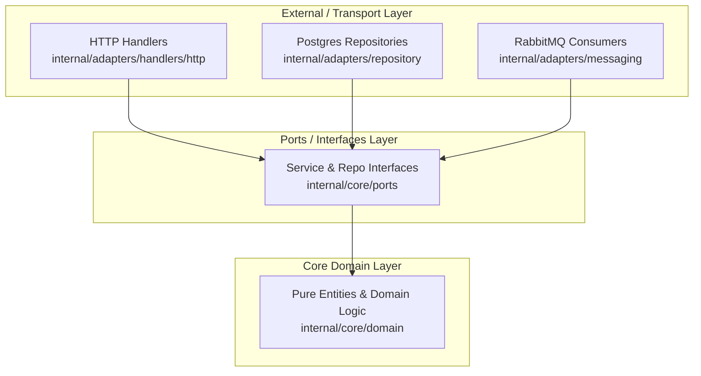

# Architecture Invariants & Design Principles

> **Directive**: This rule governs architectural integrity, boundary enforcement, and design patterns across the Discord Bot Subscription Platform.

---

## 1. Clean Architecture in Go Services

Each service in `microservices/` is structured with three core layers:

### Layer Dependency Rules:
1. **Domain (`internal/core/domain`)**:
   - Contains pure business structs and validation rules.
   - **Zero external imports** (no `database/sql`, no HTTP libraries, no third-party SDKs).
2. **Ports (`internal/core/ports`)**:
   - Defines interfaces for repositories, external clients (Vault, Stripe/PayPal, K8s), and service use cases.
3. **Adapters (`internal/adapters`)**:
   - HTTP Handlers, Database Repositories, RabbitMQ event consumers/publishers.
   - Implements ports interfaces.

---

## 2. Database-per-Service Pattern

1. Five isolated databases on PostgreSQL 16:
   - `auth_db`: User accounts, Discord OAuth2 tokens, sessions.
   - `catalog_db`: Bot templates, tiers, subscription plans, pricing.
   - `billing_db`: Active subscriptions, payment history, promo codes, gift vouchers.
   - `deploy_db`: K8s deployment metadata, turnkey token pool, bot customization state.
   - `monitor_db`: Health check targets, poll intervals, ping & latency logs.
2. Under no circumstance should one service execute SQL queries against another service's database.
3. Cross-service entity correlations are established via string IDs (`guild_id`, `user_id`, `subscription_id`, `bot_id`).

---

## 3. Asynchronous Choreography via RabbitMQ

1. All asynchronous events flow through the topic exchange `discord.events`.
2. Standard event envelopes:
   - `event_id` (UUID)
   - `event_type` (e.g. `subscription.created`)
   - `timestamp` (RFC3339)
   - `payload` (JSON object)
3. Consumers must be idempotent: processing the same event ID twice must not result in duplicate K8s pods or double billing.

---

## 4. Multi-Bot Fleet Guild Tenancy

1. A single guild can run multiple bots.
2. In all databases, `instance_label` differentiates instances (e.g. `"Lobby Music"`, `"VIP Room"`).
3. Kubernetes pod naming rule: `bot-{guildId}-{depShortId}` (e.g., `bot-9876543210-9b4e1f7c`).
4. `monitoring_targets` in `monitor_db` uniquely indexes `bot_id` (the deployment ID), not `guild_id`.

---

## 5. Security & Secret Management

1. Bot tokens and third-party API keys are stored in HashiCorp Vault KV v2.
2. Vault path: `secret/data/bots/{bot_id}` or `secret/data/bots/pool/{pool_id}`.
3. Never log sensitive tokens or return full raw tokens in API responses.
