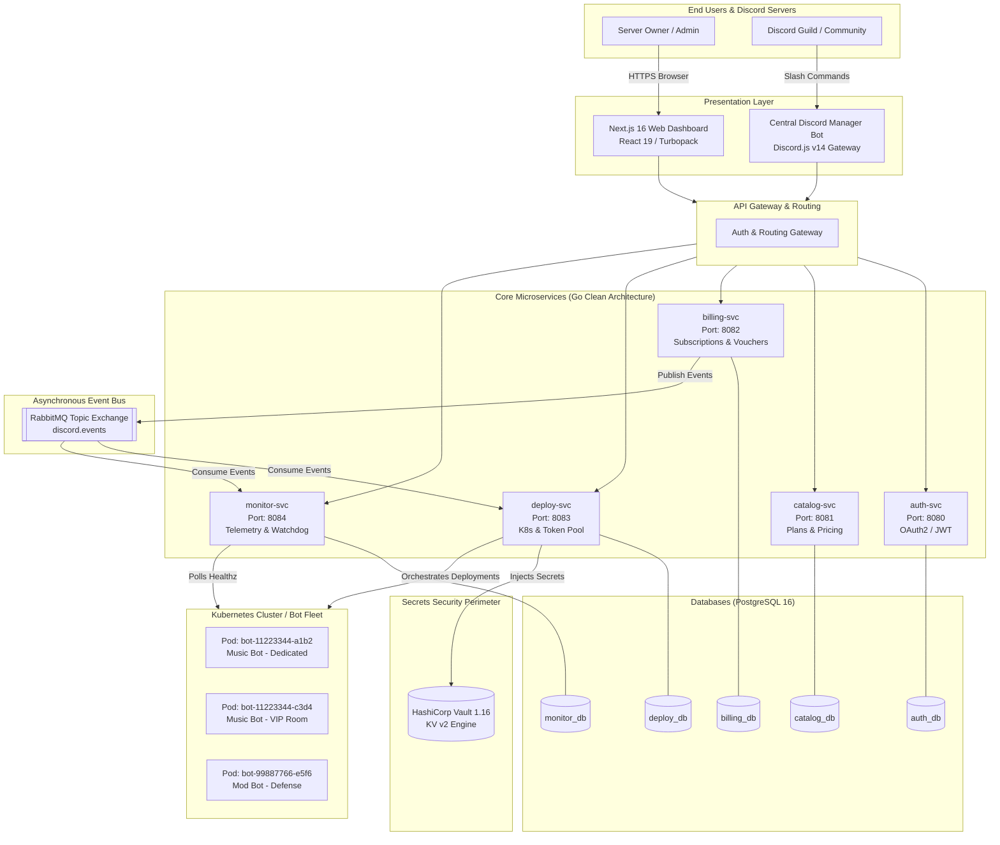
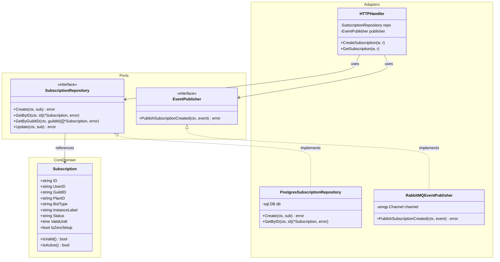
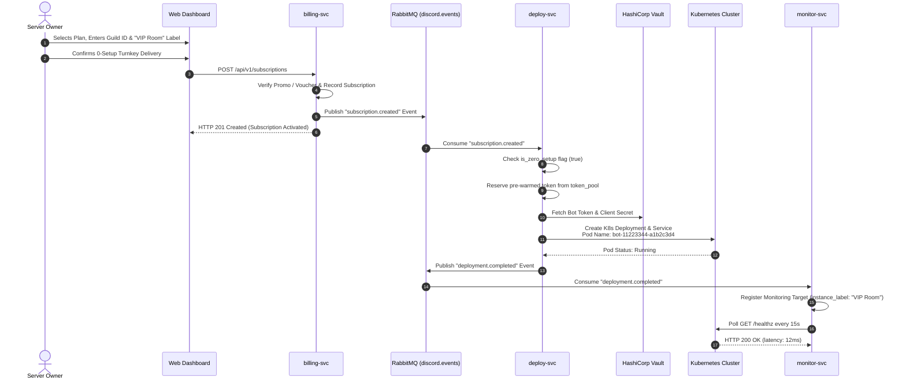
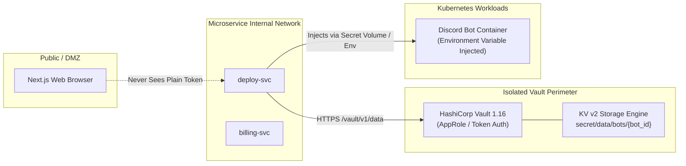

# System Architecture & Technical Design

This document details the architectural topology, communication paradigms, security boundary, and orchestration mechanics powering the **Discord Bot Subscription Platform**.

---

## 1. High-Level Architecture Topology

The platform operates as a distributed system designed for high availability, multi-tenant security, and horizontal scalability.

---

## 2. Microservice Layer & Clean Architecture

Each microservice is authored in Go 1.26+ and strictly enforces the **Ports and Adapters (Hexagonal / Clean Architecture)** design pattern. This decouples business logic from external frameworks, database drivers, and messaging transports.

### Layer Responsibilities
1. **Core Domain (`internal/core/domain`)**:
   - Represents the enterprise business rules and entities.
   - Completely free of external package dependencies (no `net/http`, no `database/sql`, no ORMs).
2. **Ports (`internal/core/ports`)**:
   - Interfaces defining inbound operations (services/use cases) and outbound operations (repositories, event publishers, external APIs).
3. **Adapters (`internal/adapters`)**:
   - Primary (Driving) Adapters: REST HTTP handlers decoding JSON requests and invoking domain use cases.
   - Secondary (Driven) Adapters: PostgreSQL database repositories executing parameterized SQL, and RabbitMQ publishers/subscribers.

---

## 3. Communication Patterns: Sync vs Async

| Interaction | Protocol | Mechanism | Rationale |
| :--- | :--- | :--- | :--- |
| **User Navigation & Dashboard Queries** | Synchronous REST | HTTP / JSON | Immediate feedback required for UI rendering, catalog browsing, and status queries. |
| **Manager Bot Commands** | Synchronous REST | HTTP / JSON | Discord slash command interactions have a 3-second reply window requiring direct responses. |
| **Checkout & Subscription Lifecycle** | Asynchronous Event-Driven | AMQP over RabbitMQ | Guarantees eventual consistency, decoupling payment processing from Kubernetes pod scheduling. |
| **Watchdog Health Notifications** | Asynchronous Event-Driven | AMQP over RabbitMQ | Alerts and restart requests are dispatched asynchronously without blocking polling loops. |

---

## 4. End-to-End Subscription & Deployment Sequence

The sequence diagram below illustrates the exact lifecycle from user checkout to running Kubernetes bot pod:

---

## 5. Security Perimeter & HashiCorp Vault Integration

Discord Bot Tokens grant privileged access to Discord servers and must be defended against database breaches and code exposure:

### Security Rules:
1. **Never Stored in PostgreSQL**: Discord bot tokens and OAuth client secrets are strictly forbidden from being stored in plaintext in any PostgreSQL database.
2. **Path Convention**:
   - Turnkey Pool Tokens: `secret/data/bots/pool/{pool_id}`
   - Customer-Owned Tokens: `secret/data/bots/{deployment_id}`
3. **Quarantine Mechanism**: Compromised or corrupted tokens are flagged as `quarantined` in `deploy_db.token_pool` and locked from reuse.
