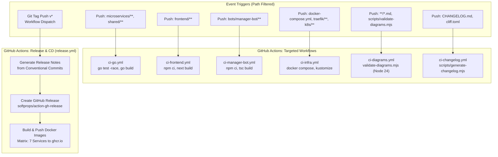

# CI/CD Pipeline & Automated Changelog System

This document outlines the Continuous Integration (CI), Continuous Deployment (CD), and automated Conventional Commits Changelog generation system powering the **Discord Bot Subscription Platform**.

---

## 1. CI/CD Architecture Overview



---

## 2. Targeted Continuous Integration Workflows

The CI pipeline is modularized into **6 focused workflows** that fire **only when relevant code paths are modified**, saving runner minutes and preventing unnecessary rebuilds:

### Workflows & Path Filter Matrix

| Workflow File | Trigger Paths Filter | Environment | Tools | What it Verifies |
| :--- | :--- | :--- | :--- | :--- |
| **`ci-go.yml`** | `microservices/**`, `shared/**`, `go.work*`, `**/go.mod`, `**/go.sum` | `ubuntu-latest` | Go 1.23 | Unit tests with race detection (`go test -race ./shared/... ./microservices/...`) & builds 5 service binaries. |
| **`ci-frontend.yml`** | `frontend/**` | `ubuntu-latest` | Node.js 20 | Runs `npm ci` and compiles Next.js 16 Turbopack production build. |
| **`ci-manager-bot.yml`** | `bots/manager-bot/**` | `ubuntu-latest` | Node.js 20 | Runs `npm ci` and compiles TypeScript bot code into `dist/` without type errors. |
| **`ci-infra.yml`** | `docker-compose.yml`, `traefik/**`, `k8s/**`, `scripts/init-databases.sql` | `ubuntu-latest` | Docker & Kustomize | Runs `docker compose config --quiet` and `kubectl kustomize k8s/` syntax validation. |
| **`ci-diagrams.yml`** | `**/*.md`, `scripts/validate-diagrams.mjs`, `package*.json` | `ubuntu-latest` | Node.js 24 | Validates all Markdown Mermaid diagrams in headless JSDOM with Mermaid v12. |
| **`ci-changelog.yml`** | `CHANGELOG.md`, `scripts/generate-changelog.mjs`, `cliff.toml` | `ubuntu-latest` | Node.js 20 | Verifies `CHANGELOG.md` is strictly synchronized with repository commits via `npm run changelog:check`. |

---

## 3. Automated Release & CD Workflow (`release.yml`)

When a git tag matching `v*` (e.g. `v1.0.0`, `v1.1.0`) is pushed, or when triggered manually via GitHub `workflow_dispatch`, the release pipeline runs:

1. **Changelog Extraction**: Generates the latest section of `CHANGELOG.md` and extracts Markdown notes for the target tag into `RELEASE_NOTES.md`.
2. **GitHub Release**: Creates an official GitHub Release with release notes and version links.
3. **Multi-Container GHCR Deployment**: Executes a parallel matrix build for all 7 platform container images and pushes them to GitHub Container Registry (`ghcr.io`):
   - `ghcr.io/Abdo30004/auth-svc`
   - `ghcr.io/Abdo30004/catalog-svc`
   - `ghcr.io/Abdo30004/billing-svc`
   - `ghcr.io/Abdo30004/deploy-svc`
   - `ghcr.io/Abdo30004/monitor-svc`
   - `ghcr.io/Abdo30004/manager-bot`
   - `ghcr.io/Abdo30004/frontend`

---

## 4. Changelog Generation System

The platform provides a dual-tooling changelog system based on **Conventional Commits**:

### 4.1 Native Generator (`scripts/generate-changelog.mjs`)
A dependency-free Node.js ESM script that inspects git history, categorizes commits, formats Markdown headers, and embeds clickable links to GitHub commit hashes.

#### Categories Generated
- 🚀 **Features & Capabilities** (`feat`)
- 🐛 **Bug Fixes & Resilience** (`fix`)
- 🌐 **Gateway, Traefik & Networking** (`gateway`, `traefik`)
- ☁️ **Kubernetes & Cloud Orchestration** (`k8s`)
- 🏗️ **Infrastructure & Persistence** (`infra`)
- 📚 **Documentation & Architecture Guides** (`docs`)
- ⚡ **Performance Optimizations** (`perf`)
- ♻️ **Refactoring & Clean Architecture** (`refactor`)
- 🧪 **Testing & Validation** (`test`)
- 📦 **Build System & Dependencies** (`build`)
- 🤖 **CI/CD Automation** (`ci`)
- 🔧 **Maintenance & Scaffolding** (`chore`)

### 4.2 Git-Cliff Support (`cliff.toml`)
For teams integrating with `git-cliff` or `git-cliff-action`, [`cliff.toml`](../cliff.toml) is configured with equivalent category mapping and markdown templates.

---

## 5. Developer Runbook & CLI Commands

### Generating or Checking Changelog Locally
```bash
# Generate / Update CHANGELOG.md from all repository commits
npm run changelog
# or via Makefile
make changelog

# Verify CHANGELOG.md is up to date (exit code 0 if matches, 1 if out of date)
npm run changelog:check
# or via Makefile
make changelog-check
```

### Full Local Verification Suite
```bash
# Runs Go tests, builds all components, validates Docker Compose, validates K8s, checks changelog
make check-all
```

### Creating a Release Tag
```bash
# 1. Update changelog
npm run changelog

# 2. Stage and commit
git add CHANGELOG.md
git commit -m "docs(changelog): update changelog for v1.1.0"

# 3. Create tag and push
git tag -a v1.1.0 -m "Release v1.1.0"
git push origin main --tags
```
