# Database Schemas & Entity Relationship Models

This document details the PostgreSQL 16 database architecture powering the platform. The platform implements the **Database-per-Service** pattern, provisioning five physically and logically isolated databases to prevent cross-service coupling.

---

## 1. Relational Entity Overview (Mermaid ERD)

```mermaid
erDiagram
    %% auth_db
    users {
        VARCHAR_64 id PK
        VARCHAR_128 username
        VARCHAR_128 global_name
        VARCHAR_128 avatar
        VARCHAR_255 email
        BOOLEAN is_admin
        TIMESTAMPTZ admin_promoted_at
        VARCHAR_64 admin_promoted_by
        BOOLEAN has_oauth_token
        TIMESTAMPTZ token_expires_at
        TIMESTAMPTZ created_at
        TIMESTAMPTZ updated_at
    }

    %% catalog_db
    bot_templates {
        VARCHAR_64 id PK
        VARCHAR_64 slug UK
        VARCHAR_128 name
        TEXT description
        VARCHAR_32 category
        VARCHAR_255 docker_image
        VARCHAR_64 default_image_tag
        BOOLEAN supports_dedicated
        BOOLEAN supports_shared
        TIMESTAMPTZ created_at
    }
    subscription_plans {
        VARCHAR_64 id PK
        VARCHAR_64 bot_id FK
        VARCHAR_128 name
        TEXT description
        VARCHAR_16 interval
        BIGINT price_cents
        VARCHAR_8 currency
        BOOLEAN is_dedicated
        JSONB features
        TIMESTAMPTZ created_at
    }

    %% billing_db
    subscriptions {
        VARCHAR_64 id PK
        VARCHAR_64 user_id
        VARCHAR_64 guild_id
        VARCHAR_64 plan_id
        VARCHAR_64 bot_type
        VARCHAR_128 instance_label
        VARCHAR_32 status
        VARCHAR_32 provider
        VARCHAR_128 external_sub_id
        BOOLEAN is_dedicated
        BOOLEAN is_zero_setup
        TIMESTAMPTZ valid_until
        TIMESTAMPTZ created_at
    }
    promo_codes {
        VARCHAR_64 id PK
        VARCHAR_64 code UK
        VARCHAR_32 discount_type
        BIGINT discount_value
        INT max_uses
        INT current_uses
        TIMESTAMPTZ expires_at
        BOOLEAN is_active
        TIMESTAMPTZ created_at
    }
    voucher_codes {
        VARCHAR_64 id PK
        VARCHAR_64 code UK
        VARCHAR_64 plan_id
        VARCHAR_64 bot_type
        INT duration_days
        BOOLEAN is_dedicated
        BOOLEAN is_redeemed
        VARCHAR_64 redeemed_by_user_id
        VARCHAR_64 redeemed_by_guild_id
        TIMESTAMPTZ redeemed_at
        TIMESTAMPTZ created_at
    }

    %% deploy_db
    deployments {
        VARCHAR_64 id PK
        VARCHAR_64 subscription_id
        VARCHAR_64 user_id
        VARCHAR_64 guild_id
        VARCHAR_64 bot_type
        VARCHAR_128 instance_label
        VARCHAR_64 k8s_namespace
        VARCHAR_128 k8s_deployment_name
        VARCHAR_255 image_name
        VARCHAR_64 image_tag
        VARCHAR_32 status
        BOOLEAN is_zero_setup
        VARCHAR_64 client_id
        TEXT error_message
        TIMESTAMPTZ created_at
    }
    token_pool {
        VARCHAR_64 id PK
        VARCHAR_64 bot_type
        VARCHAR_64 client_id
        VARCHAR_255 token_vault_path
        TEXT token_encrypted
        VARCHAR_32 status
        VARCHAR_64 assigned_guild_id
        VARCHAR_64 assigned_subscription_id
        TIMESTAMPTZ assigned_at
        TIMESTAMPTZ created_at
    }

    %% monitor_db
    monitoring_targets {
        VARCHAR_64 id PK
        VARCHAR_64 bot_id UK
        VARCHAR_64 guild_id
        VARCHAR_128 instance_label
        VARCHAR_255 health_url
        INT poll_interval_sec
        BOOLEAN is_active
        VARCHAR_32 current_status
        INT consecutive_failures
        TIMESTAMPTZ last_checked_at
        TIMESTAMPTZ created_at
    }
    health_logs {
        BIGSERIAL id PK
        VARCHAR_64 target_id FK
        VARCHAR_32 status
        INT status_code
        BIGINT latency_ms
        TEXT error_message
        BIGINT discord_ping_ms
        BIGINT memory_usage_mb
        TIMESTAMPTZ checked_at
    }

    bot_templates ||--o{ subscription_plans : "defines"
    monitoring_targets ||--o{ health_logs : "records"
```

---

## 2. Service Database Specifications

### 2.1 `auth_db`
- **Owner**: `auth-svc` (Port 8080)
- **Tables**:
  - `users`: Stores Discord user accounts, OAuth token presence flag (`has_oauth_token`), token expiration timestamp, and administrator appointments (`is_admin`, `admin_promoted_at`, `admin_promoted_by`). Discord OAuth access and refresh tokens are securely encrypted and stored in HashiCorp Vault (`secret/data/users/{userId}`) rather than plaintext database columns.
- **Indexes**:
  - `idx_users_username` on `users(username)`
  - `idx_users_is_admin` on `users(is_admin) WHERE is_admin = true`

---

### 2.2 `catalog_db`
- **Owner**: `catalog-svc` (Port 8081)
- **Tables**:
  - `bot_templates`: Pre-configured bot archetypes (e.g., `bot-music-01`, `bot-mod-02`, `bot-game-03`).
  - `subscription_plans`: Subscription tiers, prices in cents, billing intervals, and feature lists.
- **Foreign Keys**:
  - `subscription_plans.bot_id` $\to$ `bot_templates.id` (`ON DELETE CASCADE`)
- **Indexes**:
  - `idx_subscription_plans_bot_id` on `subscription_plans(bot_id)`

---

### 2.3 `billing_db`
- **Owner**: `billing-svc` (Port 8082)
- **Tables**:
  - `subscriptions`: Active and historical server subscriptions. Contains `instance_label`, `is_dedicated`, and `is_zero_setup`.
  - `promo_codes`: Percentage or fixed discounts (e.g., `SUMMER50`, `VIPFREE`, `SAVE2`).
  - `voucher_codes`: 100% covered gift cards for prepaid access (e.g., `GIFT-MUSIC-PRO-30D`).
- **Indexes**:
  - `idx_subscriptions_guild_id` on `subscriptions(guild_id)`
  - `idx_subscriptions_user_id` on `subscriptions(user_id)`
  - `idx_subscriptions_status` on `subscriptions(status)`
  - `idx_promo_codes_code` on `promo_codes(code)`
  - `idx_voucher_codes_code` on `voucher_codes(code)`

---

### 2.4 `deploy_db`
- **Owner**: `deploy-svc` (Port 8083)
- **Tables**:
  - `deployments`: Records of active Kubernetes container workloads, pod names (`bot-{guildId}-{depShortId}`), and runtime status.
  - `token_pool`: Pre-warmed Discord bot tokens allocated for turnkey 0-setup provisioning.
- **Indexes**:
  - `idx_deployments_guild_id` on `deployments(guild_id)`
  - `idx_deployments_subscription_id` on `deployments(subscription_id)`
  - `idx_deployments_status` on `deployments(status)`
  - `idx_token_pool_type_status` on `token_pool(bot_type, status)`
  - `idx_token_pool_guild_id` on `token_pool(assigned_guild_id)`

---

### 2.5 `monitor_db`
- **Owner**: `monitor-svc` (Port 8084)
- **Tables**:
  - `monitoring_targets`: Polling configurations and current state for each deployed bot.
  - `health_logs`: Time-series telemetry recording HTTP latency, Discord gateway ping, and container memory usage.
- **Foreign Keys**:
  - `health_logs.target_id` $\to$ `monitoring_targets.id` (`ON DELETE CASCADE`)
- **Indexes**:
  - `idx_monitoring_targets_is_active` on `monitoring_targets(is_active)`
  - `idx_monitoring_targets_guild_id` on `monitoring_targets(guild_id)`
  - `idx_health_logs_target_id` on `health_logs(target_id, checked_at DESC)`

---

## 3. Database Migration & Initialization Script

All tables, indexes, and initial catalog seed data are maintained in:
👉 [`scripts/init-databases.sql`](file:///C:/Users/kasep/Desktop/discord-subscriptions/scripts/init-databases.sql)

When deploying locally via Docker Compose, this script is mounted directly to `/docker-entrypoint-initdb.d/01-init-databases.sql` and executes automatically upon the initial PostgreSQL boot.
