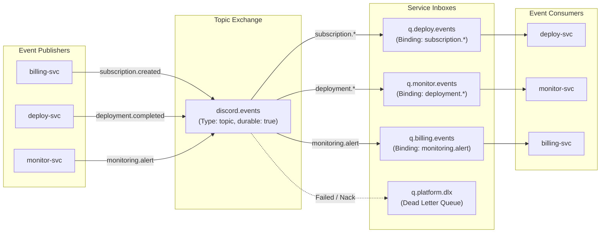

# Event-Driven Specification & RabbitMQ Choreography

This document details the asynchronous event-driven messaging architecture of the platform. Inter-service coordination is decoupled via a centralized **RabbitMQ Topic Exchange (`discord.events`)**, guaranteeing eventual consistency, fault tolerance, and independent service deployability.

---

## 1. Message Broker Topology



### Broker Configuration Settings:
- **Exchange Name**: `discord.events`
- **Exchange Type**: `topic`
- **Durable**: `true`
- **Dead Letter Exchange (DLX)**: `discord.events.dlx` (Type: `direct`, durable: `true`)
- **Dead Letter Queue (DLQ)**: `discord.events.dlq` (Routing key: `dlq`, durable: `true`)
- **Retry Policy**: Up to 3 retry attempts with exponential backoff via `x-retry-count` header before dead-lettering via un-requeued `Nack(false, false)`.
- **Channel Isolation**: Independent AMQP channels for publishing (`pubChannel`) and subscribing (`subChannel`) to eliminate deadlock risks.
- **Auto-Reconnection**: Resilient client loop with exponential backoff (1s-30s) and automatic re-subscription on broker reconnect.

---

## 2. Canonical Event Envelope & Versioning

Every event published to RabbitMQ conforms to the canonical envelope defined in `shared/events/event.go`. Events carry an explicit `schema_version` in their JSON body and an `x-event-version` AMQP header for schema evolution:

```json
{
  "event_id": "evt_01HZX8P00J...",
  "event_type": "subscription.created",
  "source": "billing-svc",
  "timestamp": "2026-09-26T02:30:00Z",
  "schema_version": "1.0",
  "payload": {}
}
```

### AMQP Message Headers:
- `x-event-version`: Schema version string (`"1.0"`)
- `x-retry-count`: Current retry attempt count (integer `0`-`3`)

### Consumer Idempotency & Deduplication:
All consumers integrate the `messaging.EventDeduplicator` memory-bounded cache (24-hour sliding TTL) keyed by `event_id`. Downstream services (`deploy-svc`, `monitor-svc`) additionally enforce domain state-machine checks (e.g. checking existing active deployment for a subscription before provisioning).

---

## 3. Event Catalog & JSON Payload Schemas

### 3.1 `subscription.created`
- **Routing Key**: `subscription.created`
- **Publisher**: `billing-svc`
- **Consumer**: `deploy-svc`
- **Payload Schema**:
```json
{
  "subscription_id": "sub_1092830491823",
  "user_id": "112233445566778899",
  "guild_id": "998877665544332211",
  "plan_id": "plan-music-pro",
  "bot_type": "music",
  "instance_label": "VIP Lounge Music",
  "is_dedicated": true,
  "is_zero_setup": true,
  "valid_until": "2026-10-26T00:00:00Z"
}
```

---

### 3.2 `subscription.canceled`
- **Routing Key**: `subscription.canceled`
- **Publisher**: `billing-svc`
- **Consumer**: `deploy-svc`, `monitor-svc`
- **Payload Schema**:
```json
{
  "subscription_id": "sub_1092830491823",
  "guild_id": "998877665544332211",
  "reason": "customer_requested",
  "canceled_at": "2026-09-26T02:35:00Z"
}
```

---

### 3.3 `deployment.requested`
- **Routing Key**: `deployment.requested`
- **Publisher**: `deploy-svc` (Internal orchestration)
- **Consumer**: `deploy-svc` worker
- **Payload Schema**:
```json
{
  "deployment_id": "dep_491823091823",
  "subscription_id": "sub_1092830491823",
  "guild_id": "998877665544332211",
  "bot_type": "music",
  "instance_label": "VIP Lounge Music",
  "is_zero_setup": true
}
```

---

### 3.4 `deployment.completed`
- **Routing Key**: `deployment.completed`
- **Publisher**: `deploy-svc`
- **Consumer**: `monitor-svc`
- **Payload Schema**:
```json
{
  "deployment_id": "dep_491823091823",
  "subscription_id": "sub_1092830491823",
  "guild_id": "998877665544332211",
  "bot_type": "music",
  "instance_label": "VIP Lounge Music",
  "k8s_deployment_name": "bot-998877665544332211-49182309",
  "health_url": "http://bot-998877665544332211-49182309:8080/healthz",
  "completed_at": "2026-09-26T02:30:15Z"
}
```

---

### 3.5 `deployment.restarted`
- **Routing Key**: `deployment.restarted`
- **Publisher**: `deploy-svc`
- **Consumer**: `monitor-svc`
- **Payload Schema**:
```json
{
  "deployment_id": "dep_491823091823",
  "guild_id": "998877665544332211",
  "instance_label": "VIP Lounge Music",
  "trigger": "watchdog_auto_recovery",
  "restarted_at": "2026-09-26T02:32:00Z"
}
```

---

### 3.6 `monitoring.alert`
- **Routing Key**: `monitoring.alert`
- **Publisher**: `monitor-svc`
- **Consumer**: `deploy-svc` (auto-reboot), `billing-svc` (notification)
- **Payload Schema**:
```json
{
  "target_id": "tgt_1",
  "bot_id": "dep_491823091823",
  "guild_id": "998877665544332211",
  "instance_label": "VIP Lounge Music",
  "status": "degraded",
  "consecutive_failures": 3,
  "error_message": "connection refused on :8080/healthz",
  "alert_at": "2026-09-26T02:31:45Z"
}
```

---

## 4. Idempotency & Consumer Retry Guarantees

1. **Idempotent Handlers**:
   - `deploy-svc` checks `deployments` table before provisioning. If a deployment with the matching `subscription_id` already exists, the event is acknowledged without spawning a duplicate container.
   - `monitor-svc` uses `ON CONFLICT (bot_id) DO UPDATE` to ensure duplicate `deployment.completed` events update rather than fail.
2. **Retry Protocol**:
   - Transient failures (e.g. temporary Vault connection timeout) trigger a message rejection with requeue (`BasicNack(requeue=true)`) up to 3 attempts with exponential backoff.
   - Poison messages failing 3 times are rerouted to `q.platform.dlx` for operator investigation.
