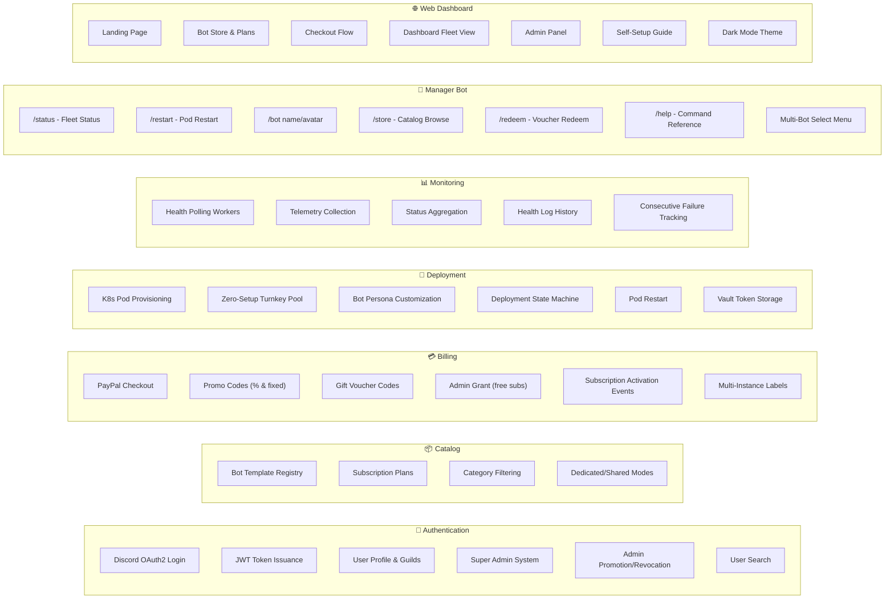
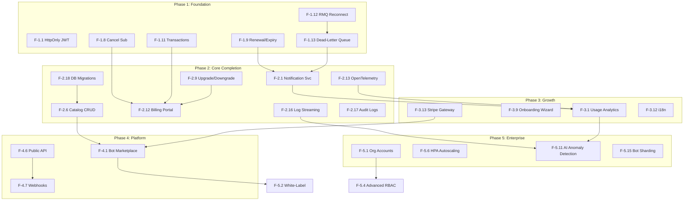

# Feature Roadmap & Development Plan

> **Generated**: September 26, 2026  
> **Platform**: Discord Bot Subscription & Turnkey Fleet Management Platform  
> **Methodology**: Deep analysis of every source file (Go microservices, Next.js frontend, Discord bot, infrastructure) cross-referenced with competitor benchmarking (MEE6, BotGhost, Arcane, Carl-bot Pro) and industry-standard SaaS feature sets  
> **Structure**: Features organized into 5 phases across short-term (0-3 months), medium-term (3-6 months), and long-term (6-12+ months) horizons

---

## Table of Contents

1. [Current Feature Inventory](#1-current-feature-inventory)
2. [Feature Gap Analysis](#2-feature-gap-analysis)
3. [Phase 1 — Foundation Hardening (Weeks 1-4)](#3-phase-1--foundation-hardening-weeks-1-4)
4. [Phase 2 — Core Product Completion (Weeks 5-12)](#4-phase-2--core-product-completion-weeks-5-12)
5. [Phase 3 — Growth & Engagement (Months 4-6)](#5-phase-3--growth--engagement-months-4-6)
6. [Phase 4 — Platform & Marketplace (Months 7-9)](#6-phase-4--platform--marketplace-months-7-9)
7. [Phase 5 — Enterprise & Scale (Months 10-12+)](#7-phase-5--enterprise--scale-months-10-12)
8. [Feature Dependency Graph](#8-feature-dependency-graph)
9. [Feature Prioritization Matrix](#9-feature-prioritization-matrix)

---

## 1. Current Feature Inventory

### What's Built & Working

### Detailed Feature Status

| Domain | Feature | Status | Notes |
|:---|:---|:---:|:---|
| **Auth** | Discord OAuth2 flow | ✅ Complete | Code exchange → JWT |
| **Auth** | JWT authentication | ✅ Complete | Bearer token validation on all services |
| **Auth** | User profile with Discord data | ✅ Complete | Username, avatar, global_name, email |
| **Auth** | Guild listing with permission filter | ✅ Complete | `MANAGE_GUILD` / `ADMINISTRATOR` |
| **Auth** | Super Admin via env config | ✅ Complete | `SUPER_ADMIN_DISCORD_IDS` |
| **Auth** | Admin promotion/revocation | ✅ Complete | Super admins can promote others |
| **Auth** | User search by ID/username | ✅ Complete | Admin-only |
| **Catalog** | Bot template CRUD | ⚠️ Read-Only | No write endpoints — templates require direct SQL |
| **Catalog** | Subscription plan management | ⚠️ Read-Only | Plans tied to templates, no admin UI for CRUD |
| **Catalog** | Category & feature display | ✅ Complete | JSONB features, category field |
| **Billing** | PayPal subscription checkout | ✅ Complete | Creates PayPal subscription, returns approval URL |
| **Billing** | PayPal webhook processing | ⚠️ Partial | Webhook handler exists, signature verification needs audit |
| **Billing** | Promo code system | ✅ Complete | Percentage & fixed discounts, max uses, expiry |
| **Billing** | Gift voucher codes | ✅ Complete | One-time redemption, plan binding, duration |
| **Billing** | Admin grant (free subscriptions) | ✅ Complete | Bypasses payment |
| **Billing** | Subscription cancellation | ⚠️ Partial | Domain model supports it, but no user-facing cancel flow |
| **Billing** | Subscription upgrade/downgrade | ❌ Not Built | No plan change logic |
| **Billing** | Invoice/payment history | ❌ Not Built | No transaction records |
| **Deploy** | K8s pod lifecycle management | ✅ Complete | Create, restart, stop via K8s API |
| **Deploy** | Deployment state machine | ✅ Complete | `pending → deploying → running → stopped/failed` |
| **Deploy** | Zero-Setup turnkey token pool | ✅ Complete | `available → assigned → quarantined` |
| **Deploy** | Bot persona customization | ✅ Complete | Name & avatar via Discord API, rate-limited |
| **Deploy** | Vault integration for bot tokens | ✅ Complete | KV v2 at `secret/data/bots/{id}` |
| **Deploy** | Self-Setup guided flow | ✅ Complete | Frontend walkthrough for custom bot tokens |
| **Monitor** | Worker pool health polling | ✅ Complete | Configurable interval & worker count |
| **Monitor** | Target registration via events | ✅ Complete | Auto-registers on `deployment.completed` |
| **Monitor** | Health log persistence | ✅ Complete | Latency, Discord ping, memory usage |
| **Monitor** | Status aggregation for dashboards | ✅ Complete | Per-guild, per-bot target views |
| **Monitor** | Alerting & notifications | ❌ Not Built | No Discord webhooks, email, or push |
| **Bot** | All 7 slash commands | ✅ Complete | status, restart, bot, store, redeem, help, subscribe |
| **Bot** | Multi-bot disambiguation | ✅ Complete | `StringSelectMenuBuilder` dropdown |
| **Bot** | Deferred reply handling | ✅ Complete | Avoids 3-second timeout |
| **Frontend** | Full page coverage | ✅ Complete | Home, Store, Checkout, Dashboard, Admin, Setup, Auth |
| **Frontend** | Real API integration | ✅ Complete | No mocks — all live endpoints |
| **Frontend** | Admin panel | ⚠️ Basic | Token pool, promo/voucher creation, staff management |
| **Infra** | Docker Compose full stack | ✅ Complete | 10 services orchestrated |
| **Infra** | Kubernetes manifests | ✅ Complete | Namespaces, RBAC, network policies |
| **Infra** | Traefik reverse proxy | ✅ Complete | Path-based routing to all services |
| **Infra** | CI/CD pipeline | ✅ Complete | 7 GitHub Actions workflows |

---

## 2. Feature Gap Analysis

### Critical Gaps (Expected but Missing)

| Gap | Why It Matters | Competitor Reference |
|:---|:---|:---|
| **No subscription cancellation UI** | Users can't self-cancel; requires manual admin intervention | MEE6, BotGhost, all SaaS platforms |
| **No upgrade/downgrade flow** | Users stuck on original plan forever | Stripe Billing, Chargebee, Paddle |
| **No payment/invoice history** | No receipts, no audit trail for purchases | Every billing platform |
| **No email or Discord notifications** | Users get no confirmations, renewals, or failure alerts | Industry standard |
| **No catalog admin CRUD** | Adding new bot templates requires raw SQL | BotGhost admin |
| **No bot log streaming** | Users can't see what their bot is doing | BotGhost, hosting platforms |
| **No usage metrics/analytics** | Users have no insights into bot command usage | MEE6 Premium, Arcane |
| **No webhook integrations** | No external system notifications | Stripe, all SaaS |
| **No audit logging** | No record of who did what, when | Enterprise compliance |
| **No i18n/localization** | English-only limits market reach | MEE6 (30+ languages) |

### Architectural Enablers Already In Place

The existing architecture enables rapid feature expansion:

| Enabler | What It Unlocks |
|:---|:---|
| **RabbitMQ event bus** | Notification service, analytics pipeline, webhook delivery |
| **Clean Architecture ports** | New adapters for Stripe, email, Discord webhooks without touching business logic |
| **K8s RBAC & orchestration** | Auto-scaling, resource quotas, log streaming |
| **Vault KV v2** | Any new secret type (Stripe keys, SMTP passwords, webhook tokens) |
| **Multi-subscription model** | Bundle pricing, cross-guild plans, reseller accounts |
| **`instance_label` threading** | Per-bot analytics, per-bot notifications, per-bot SLA tracking |

---

## 3. Phase 1 — Foundation Hardening (Weeks 1-4)

> **Goal**: Fix critical security issues and close core billing gaps to make the platform commercially viable.

### 3.1 Security Hardening Features

| ID | Feature | Priority | Effort | Service(s) |
|:---:|:---|:---:|:---:|:---|
| F-1.1 | **HttpOnly Cookie JWT Authentication** | 🔴 Critical | 3d | auth-svc, frontend |
| | Migrate JWT from `localStorage` to `HttpOnly, Secure, SameSite=Strict` cookie. Implement a `/api/v1/auth/refresh` endpoint for silent token renewal. Add CSRF token for state-mutating requests. | | | |
| F-1.2 | **Discord OAuth Token Vault Migration** | 🔴 Critical | 3d | auth-svc, shared/vault |
| | Move `access_token` and `refresh_token` from plaintext PostgreSQL columns to Vault KV v2 at `secret/data/users/{user_id}`. Store only a `has_token: boolean` flag in the `users` table. | | | |
| F-1.3 | **CORS Origin Restriction** | 🔴 Critical | 1h | traefik |
| | Replace wildcard `*` CORS with explicit allowed origins. Add environment variable `ALLOWED_ORIGINS` configurable per deployment. | | | |
| F-1.4 | **API Authentication Enforcement** | 🔴 Critical | 2h | frontend |
| | Add `Authorization: Bearer` headers to all admin and authenticated API calls in `lib/api.ts` — currently missing on `createPromoCode`, `createVoucherCode`, `adminGrantSubscription`, `addPoolTokens`, and `initiateCheckout`. | | | |
| F-1.5 | **Rate Limiter Activation** | 🟠 High | 30m | traefik |
| | Apply the already-defined `api-ratelimit` middleware to all API routers in `dynamic.yml`. Add per-IP and per-user rate limiting tiers. | | | |
| F-1.6 | **Production Vault Configuration** | 🟠 High | 2d | k8s, docker-compose |
| | Create non-dev Vault config with Raft storage, auto-unseal, ACL policies, audit logging, and TLS. Mount the existing `vault-pvc` in K8s. | | | |
| F-1.7 | **External Secrets Operator** | 🟠 High | 2d | k8s |
| | Replace plaintext `k8s/03-secrets.yaml` with `ExternalSecret` CRDs that pull from Vault. Remove secrets from Git. | | | |

### 3.2 Subscription Lifecycle Completion

| ID | Feature | Priority | Effort | Service(s) |
|:---:|:---|:---:|:---:|:---|
| F-1.8 | **Self-Service Subscription Cancellation** | 🔴 Critical | 3d | billing-svc, frontend, deploy-svc |
| | Add `POST /api/v1/billing/subscriptions/{id}/cancel` endpoint. Cancel PayPal subscription via API. Publish `subscription.cancelled` event. Deploy-svc tears down the pod. Frontend adds "Cancel Subscription" button with confirmation modal on Dashboard. | | | |
| F-1.9 | **Subscription Renewal & Expiry Handling** | 🔴 Critical | 3d | billing-svc |
| | Implement a background job that checks `valid_until` dates. Auto-transition expired subscriptions to `expired` status. Publish `subscription.expired` event for pod teardown. Send renewal reminders 7d, 3d, 1d before expiry. | | | |
| F-1.10 | **PayPal Webhook Signature Verification** | 🟠 High | 1d | billing-svc |
| | Implement proper PayPal webhook signature verification using the `PAYPAL-TRANSMISSION-SIG` header and PayPal's certificate chain validation. | | | |
| F-1.11 | **Transaction Receipt System** | 🟠 High | 2d | billing-svc, frontend |
| | Create `billing_db.transactions` table recording every checkout, renewal, refund, and grant. Add `GET /api/v1/billing/transactions/user/{userId}` endpoint. Frontend: Payment History page showing receipts with download links. | | | |

### 3.3 Messaging Resilience

| ID | Feature | Priority | Effort | Service(s) |
|:---:|:---|:---:|:---:|:---|
| F-1.12 | **RabbitMQ Auto-Reconnection** | 🟠 High | 2d | shared/messaging |
| | Implement exponential backoff reconnection with jitter on disconnect. Re-establish consumers after reconnection. Add connection health to `/readyz` probes. | | | |
| F-1.13 | **Dead-Letter Exchange & Retry Limits** | 🟠 High | 1d | shared/messaging |
| | Configure DLX (`discord.dlx`) and DLQ (`q.platform.dlx`) per the documented spec. Add `x-death` header tracking with max 5 retries before dead-lettering. | | | |
| F-1.14 | **Consumer Idempotency** | 🟡 Medium | 1d | deploy-svc, monitor-svc |
| | Track processed event IDs in a `processed_events` table. Skip duplicate events. Prevents double-deployments on requeued messages. | | | |

---

## 4. Phase 2 — Core Product Completion (Weeks 5-12)

> **Goal**: Build the features needed for a professional subscription platform — notifications, analytics, admin tools, and operational observability.

### 4.1 Notification System

| ID | Feature | Priority | Effort | Service(s) | Description |
|:---:|:---|:---:|:---:|:---|:---|
| F-2.1 | **Notification Service (new microservice)** | 🟠 High | 5d | notification-svc (new) | New Go microservice following Clean Architecture. Consumes events from RabbitMQ. Dispatches to multiple channels. Uses `notification_db` with templates, delivery logs, and user preferences. |
| F-2.2 | **Discord Webhook Notifications** | 🟠 High | 2d | notification-svc | Send rich embeds to guild channels on: subscription activated, bot deployed, bot offline, subscription expiring, payment failed. Configurable per guild via Dashboard. |
| F-2.3 | **Email Notifications (SMTP/SES)** | 🟡 Medium | 3d | notification-svc | Transactional emails for: payment receipt, subscription renewal, expiry warning, password/account changes. HTML templates with Vault-stored SMTP credentials. |
| F-2.4 | **In-App Notification Center** | 🟡 Medium | 3d | notification-svc, frontend | Bell icon in Navbar with unread count badge. Notification drawer with real-time updates (SSE or WebSocket). Read/dismiss/mark-all-read actions. |
| F-2.5 | **User Notification Preferences** | 🟡 Medium | 1d | notification-svc, frontend | Per-channel opt-in/out (Discord, email, in-app). Per-event-type toggles. Settings page in Dashboard. |

### 4.2 Catalog Admin CRUD

| ID | Feature | Priority | Effort | Service(s) | Description |
|:---:|:---|:---:|:---:|:---|:---|
| F-2.6 | **Bot Template CRUD Endpoints** | 🟠 High | 2d | catalog-svc | `POST /api/v1/admin/bots` — create template. `PUT /api/v1/admin/bots/{id}` — update. `DELETE /api/v1/admin/bots/{id}` — soft-delete. `POST /api/v1/admin/plans` — create plan. Admin JWT required. |
| F-2.7 | **Catalog Admin UI** | 🟠 High | 3d | frontend | Admin panel section: template list with edit/create forms. Plan pricing editor. Docker image + tag configuration. Category management. Feature list JSONB editor. |
| F-2.8 | **Bot Template Versioning** | 🟡 Medium | 2d | catalog-svc, deploy-svc | Track `docker_image` tag versions per template. Enable rolling updates: deploy-svc can upgrade existing pods to new image tags. "Update Available" badge in Dashboard. |

### 4.3 Subscription Management

| ID | Feature | Priority | Effort | Service(s) | Description |
|:---:|:---|:---:|:---:|:---|:---|
| F-2.9 | **Plan Upgrade/Downgrade** | 🟠 High | 4d | billing-svc, deploy-svc | `POST /api/v1/billing/subscriptions/{id}/change-plan`. Prorate billing for mid-cycle changes. Upgrade: immediate effect. Downgrade: effective at next renewal. Adjust K8s resource limits via deploy-svc. |
| F-2.10 | **Subscription Pause/Resume** | 🟡 Medium | 2d | billing-svc, deploy-svc | `POST /api/v1/billing/subscriptions/{id}/pause` and `/resume`. Pausing stops the bot pod but preserves config. Billing pauses. Resume re-deploys with same settings. |
| F-2.11 | **Subscription Gifting** | 🟡 Medium | 2d | billing-svc, frontend | Let users purchase a subscription as a gift for another guild owner. Generate a gift code that the recipient redeems. Extends existing voucher system. |
| F-2.12 | **Billing Portal** | 🟡 Medium | 3d | billing-svc, frontend | User-facing billing page: current plan details, next renewal date, payment method, upgrade/downgrade/cancel buttons, transaction history, downloadable invoices. |

### 4.4 Observability & Operations

| ID | Feature | Priority | Effort | Service(s) | Description |
|:---:|:---|:---:|:---:|:---|:---|
| F-2.13 | **OpenTelemetry Distributed Tracing** | 🟡 Medium | 3d | all services | Add `go.opentelemetry.io/otel` to shared library. Instrument HTTP handlers, RabbitMQ producers/consumers, and DB queries. Export to Jaeger/Tempo. Trace IDs in response headers. |
| F-2.14 | **Prometheus Metrics Endpoints** | 🟡 Medium | 2d | all services | Expose `/metrics` on each service: request count/latency histograms, active subscriptions gauge, deployment counts, RabbitMQ queue depths, DB connection pool stats. |
| F-2.15 | **Grafana Dashboard Templates** | 🟡 Medium | 2d | infra | Pre-built dashboards: Service Health Overview, Subscription Funnel, Deployment Pipeline, Bot Fleet Status, Revenue Metrics. |
| F-2.16 | **Bot Container Log Streaming** | 🟡 Medium | 3d | deploy-svc, frontend | `GET /api/v1/deployments/{id}/logs?tail=100&follow=true` — proxies K8s pod logs. Frontend: real-time log viewer with ANSI color support, search, and download. |
| F-2.17 | **Audit Log System** | 🟡 Medium | 3d | shared, all services | `audit_db` or per-service audit tables. Record: who, what, when, from-where for every state-changing operation. Admin UI to search and filter audit trail. |

### 4.5 Database & Migration Tooling

| ID | Feature | Priority | Effort | Service(s) | Description |
|:---:|:---|:---:|:---:|:---|:---|
| F-2.18 | **Database Migration Framework** | 🟠 High | 2d | all services | Integrate `golang-migrate` or `goose`. Each service runs migrations on startup. Version-controlled `.sql` files under `microservices/<svc>/migrations/`. Replaces `init-databases.sql` monolith. |
| F-2.19 | **Per-Service Database Users** | 🟠 High | 1d | infra, all services | Create dedicated PostgreSQL users (`auth_svc_user`, `billing_svc_user`, etc.) with minimal privileges. Stop using the `postgres` superuser. |

---

## 5. Phase 3 — Growth & Engagement (Months 4-6)

> **Goal**: Build features that drive user acquisition, retention, and engagement. Introduce analytics, self-service, and community features.

### 5.1 Analytics & Insights Dashboard

| ID | Feature | Priority | Effort | Description |
|:---:|:---|:---:|:---:|:---|
| F-3.1 | **Bot Usage Analytics** | 🟡 Medium | 5d | Track command invocations, message events, active users per bot. Store in time-series format (TimescaleDB or ClickHouse). Dashboard: daily/weekly/monthly charts, top commands, peak hours. |
| F-3.2 | **Revenue Analytics (Admin)** | 🟡 Medium | 3d | Admin dashboard: MRR, ARR, churn rate, ARPU, LTV calculations. Revenue by bot type, plan tier, and payment provider. Export to CSV. |
| F-3.3 | **Fleet Health Score** | 🟡 Medium | 2d | Composite score (0-100) per guild based on: uptime %, latency p99, failure rate, last restart. Display in Dashboard and `/status` command. |
| F-3.4 | **Usage Quota & Metering** | 🟡 Medium | 4d | Track resource consumption per subscription: CPU hours, memory, bandwidth, command invocations. Enforce plan-specific limits. Overage notifications. |

### 5.2 Enhanced Bot Management

| ID | Feature | Priority | Effort | Description |
|:---:|:---|:---:|:---:|:---|
| F-3.5 | **Bot Configuration Panel** | 🟡 Medium | 4d | Per-bot configuration editor in Dashboard. Key-value environment variables injected into the bot pod. Prefix settings, enable/disable features, custom welcome messages. Stored in Vault. |
| F-3.6 | **Scheduled Bot Maintenance Windows** | ⚠️ Low | 2d | Allow users to schedule bot restarts during low-traffic hours. Cron-based maintenance windows. Auto-restart + health verification. |
| F-3.7 | **Bot Backup & Restore** | ⚠️ Low | 3d | Snapshot bot configuration, environment, and PVC data. Restore to previous state. Useful for rollback after bad config changes. |
| F-3.8 | **Multi-Region Deployment** | ⚠️ Low | 5d | Deploy bot pods to K8s clusters in different regions (US-East, EU-West, Asia). Region selector at checkout. Latency-optimized Discord Gateway connections. |

### 5.3 Self-Service & User Experience

| ID | Feature | Priority | Effort | Description |
|:---:|:---|:---:|:---:|:---|
| F-3.9 | **Onboarding Wizard** | 🟡 Medium | 3d | Step-by-step guide for first-time users: connect Discord → select guild → browse store → checkout → deploy. Progress bar, tooltips, skip-to-dashboard option. |
| F-3.10 | **Knowledge Base / Help Center** | 🟡 Medium | 3d | Markdown-driven FAQ, setup guides, troubleshooting articles. Searchable. Integrated into Dashboard sidebar. `/help` bot command links to relevant articles. |
| F-3.11 | **Feedback & Feature Requests** | ⚠️ Low | 2d | In-app feedback widget. Upvote system for feature requests. Admin review queue. Links from Dashboard and bot commands. |
| F-3.12 | **Multi-Language Support (i18n)** | 🟡 Medium | 5d | Frontend: `next-intl` with JSON translation files. Manager Bot: Discord locale-aware responses. Start with English, Arabic, French, Spanish, German. |

### 5.4 Payment & Billing Expansion

| ID | Feature | Priority | Effort | Description |
|:---:|:---|:---:|:---:|:---|
| F-3.13 | **Stripe Payment Gateway** | 🟡 Medium | 4d | Add Stripe as alternative to PayPal. Stripe Checkout Sessions, Customer Portal, webhook handling. New `ProviderStripe PaymentProvider = "stripe"` in billing domain. |
| F-3.14 | **Cryptocurrency Payments** | ⚠️ Low | 3d | Integrate NOWPayments or CoinGate for BTC/ETH/USDT payments. Popular in Discord bot communities. Fixed-price invoices, webhook confirmation. |
| F-3.15 | **Annual Billing with Discount** | 🟡 Medium | 2d | Add `billing_cycle` field to plans (monthly, quarterly, annual). Annual plans offer 15-20% discount. Prorate on upgrade. |
| F-3.16 | **Referral Program** | ⚠️ Low | 3d | Users get unique referral codes. Referred users get 10% first month discount, referrers get account credit. Track in `billing_db.referrals` table. |

---

## 6. Phase 4 — Platform & Marketplace (Months 7-9)

> **Goal**: Transform from a managed bot service into a platform with marketplace, developer ecosystem, and community features.

### 6.1 Bot Marketplace

| ID | Feature | Priority | Effort | Description |
|:---:|:---|:---:|:---:|:---|
| F-4.1 | **Community Bot Submissions** | 🟡 Medium | 5d | Third-party developers can submit bot Docker images for marketplace listing. Submission review workflow with admin approval. Revenue sharing (70/30 developer/platform split). Developer portal with API docs. |
| F-4.2 | **Bot Ratings & Reviews** | ⚠️ Low | 3d | Star rating (1-5) and text reviews per bot template. Verified purchase badge. Admin moderation queue. Average rating on store cards. |
| F-4.3 | **Bot Categories & Search** | 🟡 Medium | 2d | Hierarchical categories (Music, Moderation, Economy, RPG, Utility, Fun). Full-text search across bot names, descriptions, features. Filter by price range, rating, popularity. |
| F-4.4 | **Featured & Trending Bots** | ⚠️ Low | 1d | Admin-curated "Featured" carousel on store. Algorithm-driven "Trending This Week" based on subscription count velocity. |
| F-4.5 | **Bot Bundles & Packages** | 🟡 Medium | 3d | Discounted bundles grouping multiple bot types (e.g., "Server Essentials: Moderation + Music + Welcome" at 25% off). Custom bundle builder UI. |

### 6.2 Developer Platform

| ID | Feature | Priority | Effort | Description |
|:---:|:---|:---:|:---:|:---|
| F-4.6 | **Public REST API with API Keys** | 🟡 Medium | 4d | API key management in user settings. Rate-limited public API for programmatic subscription management, deployment control, and monitoring data. OpenAPI 3.1 spec auto-generation. |
| F-4.7 | **Webhook Delivery System** | 🟡 Medium | 3d | User-configurable webhook URLs for events: subscription changes, bot status, health alerts. Retry with exponential backoff. Signature verification (HMAC-SHA256). Delivery log UI. |
| F-4.8 | **SDK & CLI Tool** | ⚠️ Low | 4d | TypeScript/Node.js SDK for API integration. CLI tool (`dsub`) for managing subscriptions and deployments from terminal. Useful for CI/CD integration and developer workflows. |
| F-4.9 | **Custom Bot Template Builder** | ⚠️ Low | 5d | Guided UI for packaging a Docker image as a marketplace bot template. Dockerfile validation, health endpoint requirements, environment variable declarations, feature manifest. |

### 6.3 Community & Social

| ID | Feature | Priority | Effort | Description |
|:---:|:---|:---:|:---:|:---|
| F-4.10 | **Public Server Leaderboard** | ⚠️ Low | 2d | Opt-in public leaderboard of guilds by bot count, uptime, and engagement. Badges and achievements. Gamification to encourage more subscriptions. |
| F-4.11 | **Community Forum / Discord Server Integration** | ⚠️ Low | 2d | Embedded community support forum. Or dedicated support Discord server with ticket bot. Link from Dashboard and bot `/help`. |
| F-4.12 | **Affiliate Program** | ⚠️ Low | 3d | Content creators and server owners get unique tracking links. Commission on conversions. Dashboard for affiliate stats. Payout integration. |

---

## 7. Phase 5 — Enterprise & Scale (Months 10-12+)

> **Goal**: Enterprise-grade features for large organizations, white-labeling, advanced orchestration, and AI-powered capabilities.

### 7.1 Enterprise Features

| ID | Feature | Priority | Effort | Description |
|:---:|:---|:---:|:---:|:---|
| F-5.1 | **Organization Accounts** | 🟡 Medium | 5d | Multi-user organizations with role-based access (Owner, Admin, Member, Viewer). Shared billing, centralized fleet management. SSO via SAML/OIDC for enterprise clients. |
| F-5.2 | **White-Label / Reseller Program** | ⚠️ Low | 8d | Partners can run the platform under their own brand. Custom domain, logo, colors. Separate billing and user pools. Per-reseller admin panels. Revenue sharing. |
| F-5.3 | **SLA Tiers & Priority Support** | ⚠️ Low | 3d | Enterprise plans with guaranteed uptime SLAs (99.9%, 99.99%). Priority support queue. Dedicated infrastructure. SLA monitoring dashboard with violation tracking. |
| F-5.4 | **Advanced RBAC & Permissions** | 🟡 Medium | 4d | Granular permissions per guild: who can restart bots, who can view logs, who can change plans. Role inheritance. Permission audit logging. |
| F-5.5 | **Compliance & Data Sovereignty** | ⚠️ Low | 5d | GDPR data export/deletion endpoints. Data residency controls (EU-only, US-only storage). SOC2 compliance logging. Privacy policy management. |

### 7.2 Advanced Orchestration

| ID | Feature | Priority | Effort | Description |
|:---:|:---|:---:|:---:|:---|
| F-5.6 | **Horizontal Pod Autoscaling** | 🟡 Medium | 3d | Auto-scale bot pods based on guild member count or event throughput. HPA definitions per plan tier. Scale-to-zero for inactive bots. |
| F-5.7 | **Blue-Green & Canary Deployments** | ⚠️ Low | 4d | Zero-downtime bot updates using blue-green deployment strategy. Canary rollouts for new image versions: 10% → 50% → 100% traffic shift with health gates. |
| F-5.8 | **Resource Quota per Plan** | 🟡 Medium | 2d | Enforce CPU/memory limits based on subscription plan tier. Basic: 128Mi/100m, Pro: 512Mi/250m, Enterprise: 2Gi/1000m. K8s `ResourceQuota` per pod. |
| F-5.9 | **Persistent Storage per Bot** | ⚠️ Low | 2d | Optional PVC per bot deployment for bots needing persistent state (databases, user data, economy systems). Size quota per plan tier. |
| F-5.10 | **Cross-Cluster Federation** | ⚠️ Low | 8d | Deploy bots across multiple K8s clusters. Cluster health-aware scheduling. Automatic failover. Global control plane with regional data planes. |

### 7.3 AI-Powered Features

| ID | Feature | Priority | Effort | Description |
|:---:|:---|:---:|:---:|:---|
| F-5.11 | **AI Health Anomaly Detection** | ⚠️ Low | 5d | ML model trained on health log patterns to detect anomalies before failures. Predictive alerts: "Bot X likely to crash in next 2 hours based on memory trend." |
| F-5.12 | **AI-Assisted Bot Configuration** | ⚠️ Low | 4d | Natural language bot configuration: "Set up a music bot for my gaming server that auto-plays lo-fi in the AFK channel." AI translates to config values. |
| F-5.13 | **Smart Recommendations** | ⚠️ Low | 3d | Recommend bots based on guild size, category, and existing subscriptions. "Servers like yours also use: Moderation Bot + Welcome Bot." Collaborative filtering. |
| F-5.14 | **Auto-Scaling Intelligence** | ⚠️ Low | 4d | Predict traffic spikes based on historical patterns (weekend peaks, event nights). Pre-scale bot resources before demand arrives. |

### 7.4 Manager Bot Expansion

| ID | Feature | Priority | Effort | Description |
|:---:|:---|:---:|:---:|:---|
| F-5.15 | **Bot Sharding** | 🟡 Medium | 2d | Discord.js `ShardingManager` for scaling beyond 2,500 guilds. Auto-shard based on guild count. Health probes per shard. |
| F-5.16 | **Interactive Subscription Wizard** | ⚠️ Low | 3d | Multi-step Discord modal flow: select bot type → choose plan → enter payment → confirm. Full checkout without leaving Discord. |
| F-5.17 | **`/analytics` Command** | ⚠️ Low | 2d | Display bot usage charts as embedded images. Command count, uptime %, active hours. Requires analytics backend (F-3.1). |
| F-5.18 | **`/invoice` Command** | ⚠️ Low | 1d | DM the user their latest invoice/receipt. Requires transaction system (F-1.11). |
| F-5.19 | **`/config` Command** | ⚠️ Low | 2d | View and modify bot configuration directly from Discord. Requires config panel backend (F-3.5). |

---

## 8. Feature Dependency Graph

---

## 9. Feature Prioritization Matrix

### Impact vs Effort Analysis

| Feature | User Impact | Revenue Impact | Effort | Priority Score |
|:---|:---:|:---:|:---:|:---:|
| F-1.8 Cancel Subscription | 🔴 Critical | 🟠 High | 3d | **98** |
| F-1.1 HttpOnly JWT | 🔴 Critical | — | 3d | **97** |
| F-1.4 API Auth Fix | 🔴 Critical | — | 2h | **97** |
| F-1.9 Renewal/Expiry | 🔴 Critical | 🔴 Critical | 3d | **96** |
| F-1.11 Transactions | 🟠 High | 🟠 High | 2d | **90** |
| F-2.1 Notification Service | 🟠 High | 🟡 Medium | 5d | **85** |
| F-2.9 Plan Upgrade/Downgrade | 🟠 High | 🔴 Critical | 4d | **85** |
| F-2.6 Catalog Admin CRUD | 🟠 High | 🟡 Medium | 2d | **82** |
| F-2.12 Billing Portal | 🟠 High | 🟡 Medium | 3d | **80** |
| F-2.16 Log Streaming | 🟡 Medium | 🟡 Medium | 3d | **72** |
| F-3.13 Stripe Gateway | 🟡 Medium | 🟠 High | 4d | **72** |
| F-3.1 Usage Analytics | 🟡 Medium | 🟡 Medium | 5d | **68** |
| F-3.12 i18n | 🟡 Medium | 🟡 Medium | 5d | **65** |
| F-4.1 Bot Marketplace | 🟡 Medium | 🟠 High | 5d | **65** |
| F-4.6 Public API | ⚠️ Low | 🟡 Medium | 4d | **55** |
| F-5.1 Org Accounts | ⚠️ Low | 🟠 High | 5d | **50** |
| F-5.2 White-Label | ⚠️ Low | 🟠 High | 8d | **45** |
| F-5.11 AI Anomaly Detection | ⚠️ Low | ⚠️ Low | 5d | **30** |

### Quick Win Features (High Impact, Low Effort)

| Feature | Effort | Impact |
|:---|:---:|:---|
| F-1.3 CORS Restriction | 1 hour | Closes critical security hole |
| F-1.4 API Auth Fix | 2 hours | Fixes broken admin endpoints |
| F-1.5 Rate Limiter Activation | 30 min | Already defined, just needs wiring |
| F-2.19 Per-Service DB Users | 1 day | Principle of least privilege |
| F-4.4 Featured Bots | 1 day | Improves store conversion |
| F-5.18 `/invoice` Command | 1 day | User convenience (after F-1.11) |

### Implementation Summary by Phase

| Phase | Duration | Features | New Services | Estimated Effort |
|:---|:---:|:---:|:---:|:---:|
| **Phase 1**: Foundation | Weeks 1-4 | 14 features | — | ~25 dev-days |
| **Phase 2**: Core Completion | Weeks 5-12 | 19 features | notification-svc | ~45 dev-days |
| **Phase 3**: Growth | Months 4-6 | 16 features | analytics pipeline | ~50 dev-days |
| **Phase 4**: Platform | Months 7-9 | 12 features | marketplace-svc | ~40 dev-days |
| **Phase 5**: Enterprise | Months 10-12+ | 19 features | org-svc | ~65 dev-days |
| **Total** | 12 months | **80 features** | 3 new services | **~225 dev-days** |

---

> [!IMPORTANT]
> **Phase 1 is mandatory before any commercial launch.** Self-service cancellation (F-1.8), renewal handling (F-1.9), and security fixes (F-1.1 through F-1.7) are legal and operational requirements for a subscription business. Phases 2-5 should be prioritized based on user feedback and business metrics after launch.
