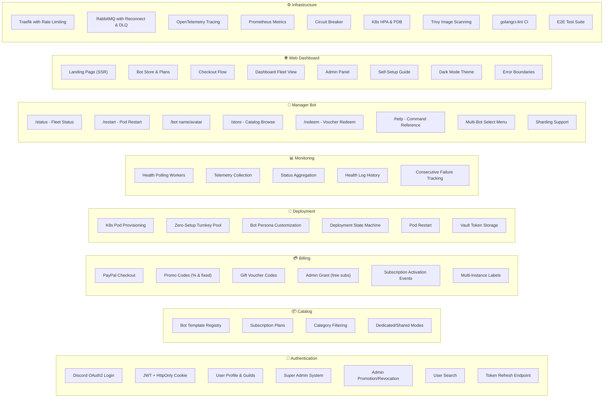
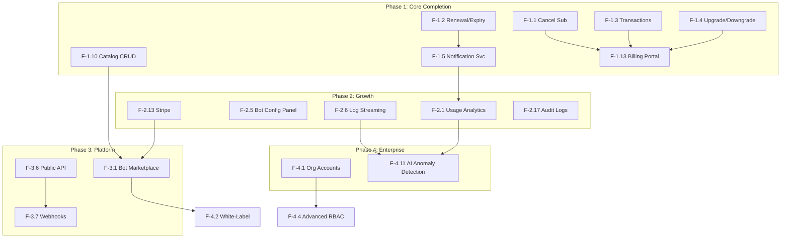

# Feature Roadmap & Development Plan

> **Generated**: September 26, 2026  
> **Platform**: Discord Bot Subscription & Turnkey Fleet Management Platform  
> **Methodology**: Deep analysis of every source file cross-referenced with competitor benchmarking (MEE6, BotGhost, Arcane, Carl-bot Pro) and industry-standard SaaS feature sets  
> **Scope**: This document covers **only planned new features**. Bug fixes, security patches, and infrastructure remediation are tracked in [REPORT.md](./REPORT.md).

---

## Table of Contents

1. [Current Feature Inventory](#1-current-feature-inventory)
2. [Feature Gap Analysis](#2-feature-gap-analysis)
3. [Phase 1 — Core Product Completion (Weeks 1-6)](#3-phase-1--core-product-completion-weeks-1-6)
4. [Phase 2 — Growth & Engagement (Months 2-4)](#4-phase-2--growth--engagement-months-2-4)
5. [Phase 3 — Platform & Marketplace (Months 5-7)](#5-phase-3--platform--marketplace-months-5-7)
6. [Phase 4 — Enterprise & Scale (Months 8-12+)](#6-phase-4--enterprise--scale-months-8-12)
7. [Feature Dependency Graph](#7-feature-dependency-graph)
8. [Feature Prioritization Matrix](#8-feature-prioritization-matrix)

---

## 1. Current Feature Inventory

### What's Built & Working

### Detailed Feature Status

| Domain | Feature | Status | Notes |
|:---|:---|:---:|:---|
| **Auth** | Discord OAuth2 + JWT + HttpOnly cookies | ✅ Complete | `/refresh` endpoint with cookie rotation |
| **Auth** | Super Admin + admin promotion/revocation | ✅ Complete | `SUPER_ADMIN_DISCORD_IDS` + DB promotion |
| **Auth** | User search by ID/username | ✅ Complete | Admin-only |
| **Catalog** | Bot template registry | ⚠️ Read-Only | No write endpoints — templates require direct SQL |
| **Catalog** | Subscription plan management | ⚠️ Read-Only | No admin UI for CRUD |
| **Billing** | PayPal checkout + webhooks | ✅ Complete | Subscription creation + approval URL |
| **Billing** | Promo codes + Gift vouchers | ✅ Complete | Percentage/fixed discounts, one-time codes |
| **Billing** | Admin grant (free subscriptions) | ✅ Complete | Bypasses payment |
| **Billing** | Subscription cancellation | ⚠️ Partial | Domain model supports it, no user-facing cancel UI |
| **Billing** | Subscription upgrade/downgrade | ❌ Not Built | No plan change logic |
| **Billing** | Invoice/payment history | ❌ Not Built | No transaction records |
| **Deploy** | K8s pod lifecycle + state machine | ✅ Complete | Create, restart, stop, state transitions |
| **Deploy** | Zero-Setup turnkey token pool | ✅ Complete | `available → assigned → quarantined` |
| **Deploy** | Bot persona customization | ✅ Complete | Name & avatar, rate-limited (2/hour) |
| **Monitor** | Health polling + telemetry | ✅ Complete | Worker pool, configurable interval |
| **Monitor** | Alerting & notifications | ❌ Not Built | No webhooks, email, or push |
| **Bot** | All 7 slash commands + sharding | ✅ Complete | Disambiguation select menus, `ShardingManager` |
| **Frontend** | Full pages (SSR landing + store) | ✅ Complete | Error boundaries, real API integration |
| **Infra** | Resilient messaging + observability | ✅ Complete | Reconnect, DLQ, OTel, Prometheus, circuit breaker |

---

## 2. Feature Gap Analysis

### Critical Gaps (Expected but Missing)

| Gap | Why It Matters | Competitor Reference |
|:---|:---|:---|
| **No subscription cancellation UI** | Users can't self-cancel; requires manual admin intervention | MEE6, BotGhost, all SaaS |
| **No upgrade/downgrade flow** | Users stuck on original plan forever | Stripe Billing, Chargebee, Paddle |
| **No payment/invoice history** | No receipts, no audit trail for purchases | Every billing platform |
| **No email or Discord notifications** | Users get no confirmations, renewals, or failure alerts | Industry standard |
| **No catalog admin CRUD** | Adding new bot templates requires raw SQL | BotGhost admin |
| **No bot log streaming** | Users can't see what their bot is doing | BotGhost, hosting platforms |
| **No usage metrics/analytics** | Users have no insights into bot command usage | MEE6 Premium, Arcane |
| **No webhook integrations** | No external system notifications | Stripe, all SaaS |
| **No audit logging** | No record of who did what, when | Enterprise compliance |
| **No i18n/localization** | English-only limits market reach | MEE6 (30+ languages) |

### Architectural Enablers Already In Place

| Enabler | What It Unlocks |
|:---|:---|
| **RabbitMQ event bus** | Notification service, analytics pipeline, webhook delivery |
| **Clean Architecture ports** | New adapters for Stripe, email, Discord webhooks without touching business logic |
| **K8s RBAC & orchestration** | Auto-scaling, resource quotas, log streaming |
| **Vault KV v2** | Any new secret type (Stripe keys, SMTP passwords, webhook tokens) |
| **Multi-subscription model** | Bundle pricing, cross-guild plans, reseller accounts |
| **`instance_label` threading** | Per-bot analytics, per-bot notifications, per-bot SLA tracking |
| **OpenTelemetry + Prometheus** | Analytics pipeline, usage metering, performance baselines |
| **Circuit breaker + DLQ** | Safe webhook delivery, resilient third-party API integrations |

---

## 3. Phase 1 — Core Product Completion (Weeks 1-6)

> **Goal**: Close the subscription lifecycle and build the minimum viable billing, notification, and admin tooling to make the platform commercially launchable.

### 3.1 Subscription Lifecycle Completion

| ID | Feature | Priority | Effort | Service(s) |
|:---:|:---|:---:|:---:|:---|
| F-1.1 | **Self-Service Subscription Cancellation** | 🔴 Critical | 3d | billing-svc, frontend, deploy-svc |
| | Add `POST /api/v1/billing/subscriptions/{id}/cancel`. Cancel PayPal subscription via API. Publish `subscription.cancelled` event → deploy-svc tears down the pod. Frontend: "Cancel Subscription" button with confirmation modal on Dashboard. | | | |
| F-1.2 | **Subscription Renewal & Expiry Handling** | 🔴 Critical | 3d | billing-svc |
| | Background job checking `valid_until` dates. Auto-transition expired subs to `expired`. Publish `subscription.expired` event for pod teardown. Renewal reminders at 7d, 3d, 1d before expiry. | | | |
| F-1.3 | **Transaction Receipt System** | 🟠 High | 2d | billing-svc, frontend |
| | Create `billing_db.transactions` table recording every checkout, renewal, refund, and grant. `GET /api/v1/billing/transactions/user/{userId}` endpoint. Frontend: Payment History page with download links. | | | |
| F-1.4 | **Plan Upgrade/Downgrade** | 🟠 High | 4d | billing-svc, deploy-svc |
| | `POST /api/v1/billing/subscriptions/{id}/change-plan`. Prorate billing for mid-cycle changes. Upgrade: immediate. Downgrade: next renewal. Adjust K8s resource limits. | | | |

### 3.2 Notification System

| ID | Feature | Priority | Effort | Service(s) |
|:---:|:---|:---:|:---:|:---|
| F-1.5 | **Notification Service (new microservice)** | 🟠 High | 5d | notification-svc (new) |
| | New Go microservice following Clean Architecture. Consumes events from RabbitMQ. Dispatches to multiple channels. `notification_db` with templates, delivery logs, and user preferences. | | | |
| F-1.6 | **Discord Webhook Notifications** | 🟠 High | 2d | notification-svc |
| | Rich embeds to guild channels on: subscription activated, bot deployed, bot offline, subscription expiring, payment failed. Configurable per guild via Dashboard. | | | |
| F-1.7 | **Email Notifications (SMTP/SES)** | 🟡 Medium | 3d | notification-svc |
| | Transactional emails: payment receipt, subscription renewal, expiry warning. HTML templates with Vault-stored SMTP credentials. | | | |
| F-1.8 | **In-App Notification Center** | 🟡 Medium | 3d | notification-svc, frontend |
| | Bell icon in Navbar with unread count. Notification drawer with real-time updates (SSE or WebSocket). Read/dismiss/mark-all-read actions. | | | |
| F-1.9 | **User Notification Preferences** | 🟡 Medium | 1d | notification-svc, frontend |
| | Per-channel opt-in/out (Discord, email, in-app). Per-event-type toggles. Settings page in Dashboard. | | | |

### 3.3 Catalog Admin CRUD

| ID | Feature | Priority | Effort | Service(s) |
|:---:|:---|:---:|:---:|:---|
| F-1.10 | **Bot Template CRUD Endpoints** | 🟠 High | 2d | catalog-svc |
| | `POST /api/v1/admin/bots`, `PUT /api/v1/admin/bots/{id}`, `DELETE /api/v1/admin/bots/{id}` (soft-delete), `POST /api/v1/admin/plans`. Admin JWT required. | | | |
| F-1.11 | **Catalog Admin UI** | 🟠 High | 3d | frontend |
| | Admin panel section: template list with edit/create forms, plan pricing editor, Docker image + tag config, category management, feature list JSONB editor. | | | |
| F-1.12 | **Bot Template Versioning** | 🟡 Medium | 2d | catalog-svc, deploy-svc |
| | Track `docker_image` tag versions per template. Rolling updates: deploy-svc upgrades existing pods to new image tags. "Update Available" badge in Dashboard. | | | |

### 3.4 Billing Portal & Management

| ID | Feature | Priority | Effort | Service(s) |
|:---:|:---|:---:|:---:|:---|
| F-1.13 | **Billing Portal** | 🟡 Medium | 3d | billing-svc, frontend |
| | User-facing billing page: current plan, next renewal date, payment method, upgrade/downgrade/cancel buttons, transaction history, downloadable invoices. | | | |
| F-1.14 | **Subscription Pause/Resume** | 🟡 Medium | 2d | billing-svc, deploy-svc |
| | `POST /api/v1/billing/subscriptions/{id}/pause` and `/resume`. Pausing stops the bot pod but preserves config. Resume re-deploys with same settings. | | | |
| F-1.15 | **Subscription Gifting** | 🟡 Medium | 2d | billing-svc, frontend |
| | Purchase a subscription as gift for another guild owner. Generate a gift code the recipient redeems. Extends existing voucher system. | | | |

---

## 4. Phase 2 — Growth & Engagement (Months 2-4)

> **Goal**: Drive user acquisition, retention, and engagement with analytics, self-service, expanded payments, and operational tools.

### 4.1 Analytics & Insights

| ID | Feature | Priority | Effort | Description |
|:---:|:---|:---:|:---:|:---|
| F-2.1 | **Bot Usage Analytics** | 🟡 Medium | 5d | Track command invocations, message events, active users per bot. Time-series storage (TimescaleDB or ClickHouse). Dashboard: daily/weekly/monthly charts, top commands, peak hours. |
| F-2.2 | **Revenue Analytics (Admin)** | 🟡 Medium | 3d | Admin dashboard: MRR, ARR, churn rate, ARPU, LTV. Revenue by bot type, plan tier, payment provider. CSV export. |
| F-2.3 | **Fleet Health Score** | 🟡 Medium | 2d | Composite score (0-100) per guild: uptime %, latency p99, failure rate, last restart. Display in Dashboard and `/status` command. |
| F-2.4 | **Usage Quota & Metering** | 🟡 Medium | 4d | Track resource consumption per subscription: CPU hours, memory, bandwidth, command invocations. Enforce plan-specific limits. Overage notifications. |

### 4.2 Enhanced Bot Management

| ID | Feature | Priority | Effort | Description |
|:---:|:---|:---:|:---:|:---|
| F-2.5 | **Bot Configuration Panel** | 🟡 Medium | 4d | Per-bot config editor in Dashboard. Key-value env vars injected into the pod. Prefix settings, enable/disable features, custom welcome messages. Stored in Vault. |
| F-2.6 | **Bot Container Log Streaming** | 🟡 Medium | 3d | `GET /api/v1/deployments/{id}/logs?tail=100&follow=true` — proxies K8s pod logs. Frontend: real-time log viewer with ANSI color, search, and download. |
| F-2.7 | **Scheduled Bot Maintenance Windows** | ⚠️ Low | 2d | Schedule bot restarts during low-traffic hours. Cron-based maintenance windows. Auto-restart + health verification. |
| F-2.8 | **Bot Backup & Restore** | ⚠️ Low | 3d | Snapshot bot config, env, and PVC data. Restore to previous state. Rollback after bad config changes. |

### 4.3 Self-Service & User Experience

| ID | Feature | Priority | Effort | Description |
|:---:|:---|:---:|:---:|:---|
| F-2.9 | **Onboarding Wizard** | 🟡 Medium | 3d | Step-by-step guide: connect Discord → select guild → browse store → checkout → deploy. Progress bar, tooltips, skip option. |
| F-2.10 | **Knowledge Base / Help Center** | 🟡 Medium | 3d | Markdown-driven FAQ, setup guides, troubleshooting articles. Searchable. Dashboard sidebar integration. `/help` links to relevant articles. |
| F-2.11 | **Feedback & Feature Requests** | ⚠️ Low | 2d | In-app feedback widget. Upvote system. Admin review queue. Links from Dashboard and bot commands. |
| F-2.12 | **Multi-Language Support (i18n)** | 🟡 Medium | 5d | Frontend: `next-intl` with JSON translation files. Manager Bot: Discord locale-aware responses. Start: English, Arabic, French, Spanish, German. |

### 4.4 Payment & Billing Expansion

| ID | Feature | Priority | Effort | Description |
|:---:|:---|:---:|:---:|:---|
| F-2.13 | **Stripe Payment Gateway** | 🟡 Medium | 4d | Stripe as alternative to PayPal. Checkout Sessions, Customer Portal, webhook handling. New `ProviderStripe PaymentProvider = "stripe"` in billing domain. |
| F-2.14 | **Cryptocurrency Payments** | ⚠️ Low | 3d | NOWPayments or CoinGate for BTC/ETH/USDT. Popular in Discord communities. Fixed-price invoices, webhook confirmation. |
| F-2.15 | **Annual Billing with Discount** | 🟡 Medium | 2d | Add `billing_cycle` field (monthly, quarterly, annual). Annual plans offer 15-20% discount. Prorate on upgrade. |
| F-2.16 | **Referral Program** | ⚠️ Low | 3d | Unique referral codes. Referred users: 10% first month off. Referrers: account credit. Track in `billing_db.referrals`. |

### 4.5 Audit & Compliance

| ID | Feature | Priority | Effort | Description |
|:---:|:---|:---:|:---:|:---|
| F-2.17 | **Audit Log System** | 🟡 Medium | 3d | `audit_db` or per-service audit tables. Record: who, what, when, from-where for every state-changing operation. Admin UI to search and filter. |
| F-2.18 | **Grafana Dashboard Templates** | 🟡 Medium | 2d | Pre-built dashboards: Service Health, Subscription Funnel, Deployment Pipeline, Bot Fleet Status, Revenue Metrics. |

---

## 5. Phase 3 — Platform & Marketplace (Months 5-7)

> **Goal**: Transform from managed bot service to a platform with marketplace, developer ecosystem, and community.

### 5.1 Bot Marketplace

| ID | Feature | Priority | Effort | Description |
|:---:|:---|:---:|:---:|:---|
| F-3.1 | **Community Bot Submissions** | 🟡 Medium | 5d | Third-party devs submit Docker images. Review workflow with admin approval. Revenue sharing (70/30). Developer portal with API docs. |
| F-3.2 | **Bot Ratings & Reviews** | ⚠️ Low | 3d | Star rating (1-5) and text reviews. Verified purchase badge. Admin moderation. Average rating on store cards. |
| F-3.3 | **Bot Categories & Search** | 🟡 Medium | 2d | Hierarchical categories (Music, Moderation, Economy, RPG, Utility). Full-text search. Filter by price, rating, popularity. |
| F-3.4 | **Featured & Trending Bots** | ⚠️ Low | 1d | Admin-curated "Featured" carousel. "Trending This Week" based on subscription velocity. |
| F-3.5 | **Bot Bundles & Packages** | 🟡 Medium | 3d | Discounted bundles: "Server Essentials: Moderation + Music + Welcome" at 25% off. Custom bundle builder UI. |

### 5.2 Developer Platform

| ID | Feature | Priority | Effort | Description |
|:---:|:---|:---:|:---:|:---|
| F-3.6 | **Public REST API with API Keys** | 🟡 Medium | 4d | API key management in user settings. Rate-limited API for programmatic subscription management, deployment control, monitoring. OpenAPI 3.1 spec. |
| F-3.7 | **Webhook Delivery System** | 🟡 Medium | 3d | User-configurable webhook URLs for events. Retry with exponential backoff. HMAC-SHA256 signature verification. Delivery log UI. |
| F-3.8 | **SDK & CLI Tool** | ⚠️ Low | 4d | TypeScript SDK for API integration. CLI tool (`dsub`) for managing from terminal. CI/CD integration. |
| F-3.9 | **Custom Bot Template Builder** | ⚠️ Low | 5d | Guided UI for packaging Docker images. Dockerfile validation, health endpoint requirements, env var declarations, feature manifest. |

### 5.3 Community & Social

| ID | Feature | Priority | Effort | Description |
|:---:|:---|:---:|:---:|:---|
| F-3.10 | **Public Server Leaderboard** | ⚠️ Low | 2d | Opt-in leaderboard by bot count, uptime, engagement. Badges and achievements. Gamification. |
| F-3.11 | **Community Forum Integration** | ⚠️ Low | 2d | Embedded forum or dedicated support Discord with ticket bot. Dashboard and `/help` links. |
| F-3.12 | **Affiliate Program** | ⚠️ Low | 3d | Unique tracking links. Commission on conversions. Dashboard for stats. Payout integration. |

---

## 6. Phase 4 — Enterprise & Scale (Months 8-12+)

> **Goal**: Enterprise-grade features for large organizations, white-labeling, advanced orchestration, and AI-powered capabilities.

### 6.1 Enterprise Features

| ID | Feature | Priority | Effort | Description |
|:---:|:---|:---:|:---:|:---|
| F-4.1 | **Organization Accounts** | 🟡 Medium | 5d | Multi-user orgs with roles (Owner, Admin, Member, Viewer). Shared billing, centralized fleet management. SSO via SAML/OIDC. |
| F-4.2 | **White-Label / Reseller Program** | ⚠️ Low | 8d | Partners run platform under their brand. Custom domain, logo, colors. Separate billing/user pools. Revenue sharing. |
| F-4.3 | **SLA Tiers & Priority Support** | ⚠️ Low | 3d | Enterprise plans with 99.9%/99.99% SLAs. Priority support queue. Dedicated infrastructure. Violation tracking. |
| F-4.4 | **Advanced RBAC & Permissions** | 🟡 Medium | 4d | Granular per-guild permissions: restart, view logs, change plans. Role inheritance. Permission audit logging. |
| F-4.5 | **Compliance & Data Sovereignty** | ⚠️ Low | 5d | GDPR export/deletion endpoints. Data residency controls. SOC2 logging. Privacy policy management. |

### 6.2 Advanced Orchestration

| ID | Feature | Priority | Effort | Description |
|:---:|:---|:---:|:---:|:---|
| F-4.6 | **Blue-Green & Canary Deployments** | ⚠️ Low | 4d | Zero-downtime bot updates. Canary rollouts: 10% → 50% → 100% traffic shift with health gates. |
| F-4.7 | **Resource Quota per Plan** | 🟡 Medium | 2d | CPU/memory limits by plan tier. Basic: 128Mi/100m, Pro: 512Mi/250m, Enterprise: 2Gi/1000m. K8s `ResourceQuota`. |
| F-4.8 | **Persistent Storage per Bot** | ⚠️ Low | 2d | Optional PVC per deployment for stateful bots (databases, economy). Size quota per plan. |
| F-4.9 | **Multi-Region Deployment** | ⚠️ Low | 5d | Bot pods in different regions (US-East, EU-West, Asia). Region selector at checkout. Latency-optimized Gateway. |
| F-4.10 | **Cross-Cluster Federation** | ⚠️ Low | 8d | Multi-cluster deployment. Cluster health-aware scheduling. Automatic failover. Global control plane. |

### 6.3 AI-Powered Features

| ID | Feature | Priority | Effort | Description |
|:---:|:---|:---:|:---:|:---|
| F-4.11 | **AI Health Anomaly Detection** | ⚠️ Low | 5d | ML model on health log patterns. Predictive alerts: "Bot X likely to crash in 2 hours based on memory trend." |
| F-4.12 | **AI-Assisted Bot Configuration** | ⚠️ Low | 4d | Natural language config: "Set up a music bot for my gaming server." AI translates to config values. |
| F-4.13 | **Smart Recommendations** | ⚠️ Low | 3d | Recommend bots based on guild size, category, existing subs. Collaborative filtering. |
| F-4.14 | **Auto-Scaling Intelligence** | ⚠️ Low | 4d | Predict traffic spikes from historical patterns. Pre-scale bot resources before demand. |

### 6.4 Manager Bot Expansion

| ID | Feature | Priority | Effort | Description |
|:---:|:---|:---:|:---:|:---|
| F-4.15 | **Interactive Subscription Wizard** | ⚠️ Low | 3d | Multi-step Discord modal: select bot → choose plan → payment → confirm. Full checkout in Discord. |
| F-4.16 | **`/analytics` Command** | ⚠️ Low | 2d | Bot usage charts as embedded images. Command count, uptime %, active hours. Requires F-2.1. |
| F-4.17 | **`/invoice` Command** | ⚠️ Low | 1d | DM user their latest receipt. Requires F-1.3. |
| F-4.18 | **`/config` Command** | ⚠️ Low | 2d | View/modify bot config from Discord. Requires F-2.5. |

---

## 7. Feature Dependency Graph

---

## 8. Feature Prioritization Matrix

### Impact vs Effort Analysis

| Feature | User Impact | Revenue Impact | Effort | Priority Score |
|:---|:---:|:---:|:---:|:---:|
| F-1.1 Cancel Subscription | 🔴 Critical | 🟠 High | 3d | **98** |
| F-1.2 Renewal/Expiry | 🔴 Critical | 🔴 Critical | 3d | **96** |
| F-1.3 Transactions | 🟠 High | 🟠 High | 2d | **90** |
| F-1.4 Upgrade/Downgrade | 🟠 High | 🔴 Critical | 4d | **88** |
| F-1.5 Notification Service | 🟠 High | 🟡 Medium | 5d | **85** |
| F-1.10 Catalog Admin CRUD | 🟠 High | 🟡 Medium | 2d | **82** |
| F-1.13 Billing Portal | 🟠 High | 🟡 Medium | 3d | **80** |
| F-2.6 Log Streaming | 🟡 Medium | 🟡 Medium | 3d | **72** |
| F-2.13 Stripe Gateway | 🟡 Medium | 🟠 High | 4d | **72** |
| F-2.1 Usage Analytics | 🟡 Medium | 🟡 Medium | 5d | **68** |
| F-2.12 i18n | 🟡 Medium | 🟡 Medium | 5d | **65** |
| F-3.1 Bot Marketplace | 🟡 Medium | 🟠 High | 5d | **65** |
| F-3.6 Public API | ⚠️ Low | 🟡 Medium | 4d | **55** |
| F-4.1 Org Accounts | ⚠️ Low | 🟠 High | 5d | **50** |
| F-4.2 White-Label | ⚠️ Low | 🟠 High | 8d | **45** |
| F-4.11 AI Anomaly Detection | ⚠️ Low | ⚠️ Low | 5d | **30** |

### Quick Win Features (High Impact, Low Effort)

| Feature | Effort | Impact |
|:---|:---:|:---|
| F-3.4 Featured Bots | 1 day | Improves store conversion |
| F-4.17 `/invoice` Command | 1 day | User convenience (after F-1.3) |
| F-4.7 Resource Quota per Plan | 2 days | Fair resource allocation |
| F-2.3 Fleet Health Score | 2 days | At-a-glance fleet health |
| F-2.15 Annual Billing | 2 days | Increases LTV and retention |

### Implementation Summary by Phase

| Phase | Duration | Features | New Services | Estimated Effort |
|:---|:---:|:---:|:---:|:---:|
| **Phase 1**: Core Completion | Weeks 1-6 | 15 features | notification-svc | ~38 dev-days |
| **Phase 2**: Growth & Engagement | Months 2-4 | 18 features | analytics pipeline | ~50 dev-days |
| **Phase 3**: Platform & Marketplace | Months 5-7 | 12 features | marketplace-svc | ~38 dev-days |
| **Phase 4**: Enterprise & Scale | Months 8-12+ | 18 features | org-svc | ~65 dev-days |
| **Total** | 12 months | **63 features** | 3 new services | **~191 dev-days** |

---

> [!IMPORTANT]
> **Phase 1 is mandatory before commercial launch.** Self-service cancellation (F-1.1), renewal handling (F-1.2), and transaction receipts (F-1.3) are legal and operational requirements for a subscription business. Security fixes and infrastructure remediations are tracked separately in [REPORT.md](./REPORT.md).
