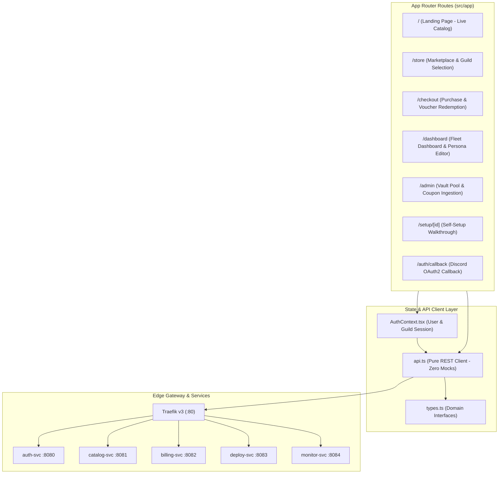

# Frontend Web Application & Dashboard

This document details the **Next.js 16 Web Dashboard and Storefront**, providing the client-side user experience for purchasing, configuring, and managing bot subscriptions.

---

## 1. Technology & UI Architecture

The frontend is built on modern web standards with performance and accessibility at the core:
- **Framework**: Next.js 16.3.6 with **Turbopack** compiler and React 19
- **Routing**: Next.js App Router (`src/app/`)
- **Styling**: Tailwind CSS with dark theme aesthetic (slate/zinc dark palette, violet/indigo accent glows)
- **Icons**: Lucide React (`lucide-react`)
- **State Management**: React Hooks (`useState`, `useEffect`, `useCallback`) backed by typed API client helpers (`src/lib/api.ts`)



---

## 2. Route Directory & Page Specifications

### 2.1 Landing Page (`src/app/page.tsx`)
- **URL**: `/`
- **Features**:
  - Hero banner with 3D/gradient background accents
  - Live metric counter (Active Bots, Servers Protected, Tracks Streamed)
  - Interactive feature highlights (Zero-Setup 1-click deployment, Dedicated K8s Pods, 99.99% SLA)
  - Pricing preview and FAQ accordion

---

### 2.2 Store & Catalog (`src/app/store/page.tsx`)
- **URL**: `/store`
- **Features**:
  - Live template listing fetched from `catalog-svc` (`GET /api/v1/catalog/templates`)
  - Filter by category (`music`, `moderation`, `game`)
  - Subscription plan cards showing monthly price, dedicated vs shared badge, and bulleted features
  - Direct *"Subscribe Now"* button routing to `/checkout?plan={id}`

---

### 2.3 Checkout Flow (`src/app/checkout/page.tsx`)
- **URL**: `/checkout`
- **Features**:
  - **Guild Selection**: Dropdown listing Discord guilds where the authenticated user holds admin permissions
  - **Instance Label Input**: Allows user to name the bot instance (e.g. `"VIP Room Music"`), ensuring multi-bot disambiguation
  - **Zero-Setup Turnkey Toggle**: Checkbox `[x] Zero-Setup Turnkey Delivery` (pre-selects managed bot pool, eliminating developer token setup)
  - **Promo Code Box**: Input field validating discount coupons via `POST /api/v1/promos/validate` with dynamic order summary price recalculation
  - **Gift Voucher Support**: Direct redemption field for 100% discount codes (`POST /api/v1/vouchers/redeem`)
  - **Payment Gate**: PayPal Checkout / simulated one-click checkout

---

### 2.4 Server Fleet Dashboard (`src/app/dashboard/page.tsx`)
- **URL**: `/dashboard`
- **Access Guard**: Protected route. Unauthenticated visitors are redirected to `/?auth=required`. Hidden from navigation when logged out.
- **Features**:
  - **Multi-Bot Fleet Switcher**: Horizontal tab bar allowing the server owner to switch between multiple bots deployed in the guild
  - **Real-Time Health Status**: Live ping (ms), uptime percentage, and container memory usage fetched from `monitor-svc`
  - **Bot Persona Customization Modal**: Real-time username and avatar editor calling `POST /api/v1/deployments/{id}/customize`
  - **Operational Controls**: Single-click *"Restart Bot"* button triggering container redeployment
  - **Deployment Logs**: Rolling log window showing container startup events and connection status

```text
+-----------------------------------------------------------------------------------------+
|  My Server: "Cyberpunk Gaming Lounge"                                                    |
|  Fleet Instances:  [ 🎵 Lobby Music ]   [ 🎵 VIP Room ]   [ 🛡️ Server Shield ]         |
+-----------------------------------------------------------------------------------------+
|  Instance: VIP Room                                    Status: 🟢 ONLINE (Ping: 18ms)   |
|  Plan: Pro Dedicated (Music)                           Memory: 142 MB / 512 MB          |
|                                                                                         |
|  [ ✏️ Edit Name & Avatar ]    [ 🔄 Restart Bot ]    [ 📋 View Container Logs ]           |
+-----------------------------------------------------------------------------------------+
```

---

### 2.5 Admin Control Panel (`src/app/admin/page.tsx`)
- **URL**: `/admin`
- **Access Guard**: Strictly restricted route (`user.is_admin || user.is_super_admin`). Non-admin or unauthenticated visitors are redirected to `/?auth=admin_required`. Hidden from navigation unless authenticated as an administrator.
- **Features**:
  - **Token Pool Gauges**: Visual charts displaying available, assigned, and quarantined pre-warmed tokens.
  - **Token Ingestion Form**: Secure interface for administrators to submit newly created Discord bot credentials into HashiCorp Vault.
  - **Promo Codes & Vouchers Generator**: Interface to create percentage/fixed discount codes and 100% covered gift card vouchers.
  - **Admin Manual Grant**: Instant provisioning of server licenses bypassing payment processors.
  - **Staff & Administrator Roster**:
    - Two-tier role hierarchy: Super Admins (immutable, configured via `SUPER_ADMIN_DISCORD_IDS`) and Appointed Admins (database-backed).
    - Super Admin user search tool with real-time avatar previews and 1-click "Promote to Admin" / "Revoke Admin" controls.
    - Appointed admins see active administrators with mutation controls safely protected.
- **Authentication Exclusivity**: Discord OAuth2 is the sole authentication mechanism across the platform. Development and mock logins have been completely removed.

---

### 2.6 Navigation Visibility & Route Guard Summary

| Route | Path | Unauthenticated Visitor | Authenticated User | Authenticated Admin |
| :--- | :--- | :--- | :--- | :--- |
| **Overview** | `/` | Visible in Navbar, public access | Visible in Navbar, public access | Visible in Navbar, public access |
| **Bot Catalog** | `/store` | Visible in Navbar, public access | Visible in Navbar, public access | Visible in Navbar, public access |
| **Checkout** | `/checkout` | Redirects to login prompt | Interactive checkout & server selector | Interactive checkout & server selector |
| **My Dashboard** | `/dashboard` | **Hidden in Navbar**, redirects `/?auth=required` | Visible in Navbar, full fleet access | Visible in Navbar, full fleet access |
| **Admin Hub** | `/admin` | **Hidden in Navbar**, redirects `/?auth=admin_required` | **Hidden in Navbar**, redirects `/?auth=admin_required` | Visible in Navbar, full admin access |

---

## 3. Environment Configuration

When deployed behind the **Traefik Edge Gateway**, the frontend defaults all service URLs to relative paths (`""`), routing every API call through Traefik port 80 without requiring CORS or open service ports on the host.

For standalone local development without Docker, environment variables can be provided in `frontend/.env.local`:

```bash
# Optional overrides (defaults to relative routing via Traefik "")
NEXT_PUBLIC_AUTH_SVC_URL=http://localhost:8080
NEXT_PUBLIC_CATALOG_SVC_URL=http://localhost:8081
NEXT_PUBLIC_BILLING_SVC_URL=http://localhost:8082
NEXT_PUBLIC_DEPLOY_SVC_URL=http://localhost:8083
NEXT_PUBLIC_MONITOR_SVC_URL=http://localhost:8084
```

---

## 4. React Server Components & Incremental Static Regeneration (ISR)

The platform utilizes a **Hybrid React Server Components (RSC)** pattern:
- **Server-Side Data Hydration**: The Landing (`/`) and Store (`/store`) pages are async Server Components (`revalidate = 60`) that fetch bot catalog templates directly from `catalog-svc` (`http://catalog-svc:8081/api/v1/bots`) at build and request time.
- **Search Engine Optimization (SEO)**: Bot templates, descriptions, and pricing tiers are rendered as pure semantic HTML, ensuring instantaneous time-to-first-byte (TTFB) and complete search crawler visibility.
- **Modular Leaf Client Components**: Interactive UI logic (Discord login buttons, guild dropdown selectors, and checkout redirects) is isolated in `'use client'` leaf modules (`LandingHeroActions.tsx`, `StoreClient.tsx`).

---

## 5. Silent 401 Session Refresh & Interceptor Protocol

All API calls in [`frontend/src/lib/api.ts`](../frontend/src/lib/api.ts) run through `apiFetch()`, an intelligent HTTP wrapper:
1. **HttpOnly Cookie Ingestion**: Automatically passes `credentials: 'include'` on all network requests.
2. **Transparent 401 Interception**: When an authenticated request fails with `HTTP 401 Unauthorized`:
   - It acquires a single shared refresh lock (`isRefreshing`).
   - Invokes `POST /api/v1/auth/refresh` on `auth-svc`.
   - `auth-svc` verifies the session, refreshes Discord OAuth credentials from HashiCorp Vault if needed, sets a fresh `auth_token` HttpOnly cookie, and returns updated session tokens.
   - Automatically replays the original failed request with the new authorization credentials without logging the user out.

---

## 6. Multi-Layered Error Boundaries & Failure Resilience

1. **Route Segment Boundary (`src/app/error.tsx`)**:
   - Catches unexpected rendering or runtime exceptions within App Router pages.
   - Provides contextual error details and "Try Again" / "Return Home" recovery buttons.
2. **Root Crash Boundary (`src/app/global-error.tsx`)**:
   - Catches catastrophic layout or provider exceptions.
   - Encapsulates its own `<html>` and `<body>` tags with a "Reload Platform" trigger.
3. **Widget Boundary (`src/components/ErrorBoundary.tsx`)**:
   - Reusable class component wrapping critical interactive widgets (Checkout wizard, Store configurator, Fleet tabs) so isolated module errors do not crash the entire parent view.

