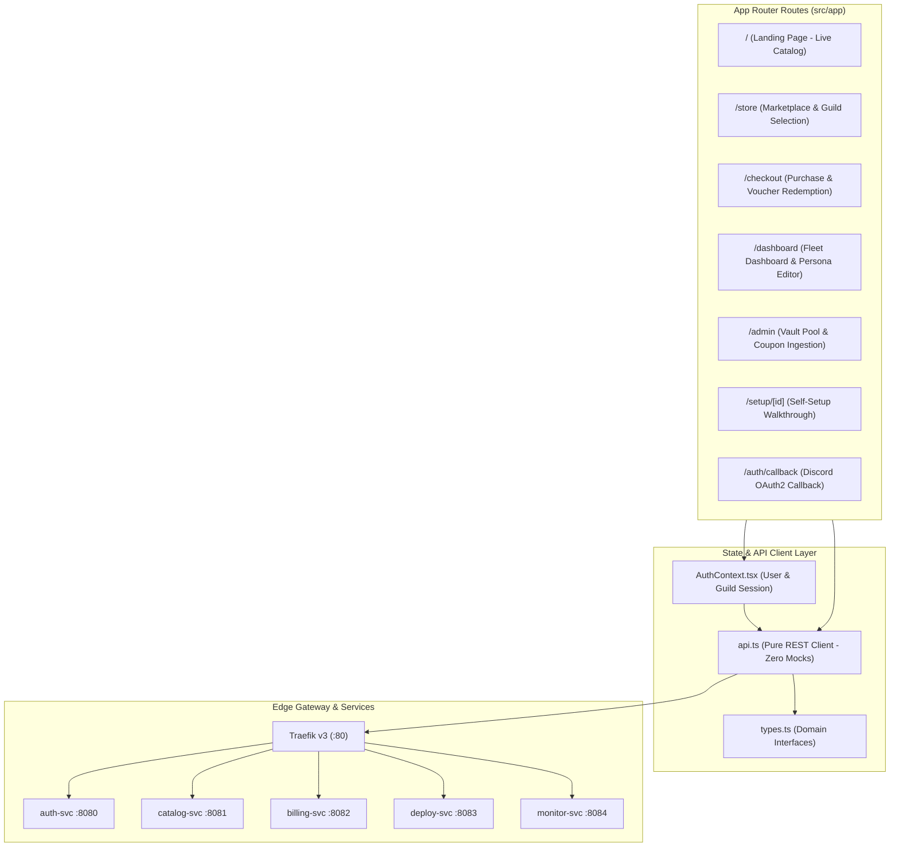

# Frontend Web Application & Dashboard

This document details the **Next.js 16 Web Dashboard and Storefront**, providing the client-side user experience for purchasing, configuring, and managing bot subscriptions.

---

## 1. Technology & UI Architecture

The frontend is built on modern web standards with performance and accessibility at the core:
- **Framework**: Next.js 16.3.6 with **Turbopack** compiler and React 19
- **Routing**: Next.js App Router (`src/app/`)
- **Styling**: Tailwind CSS with dark theme aesthetic (slate/zinc dark palette, violet/indigo accent glows)
- **Icons**: Lucide React (`lucide-react`)
- **State Management**: React Hooks (`useState`, `useEffect`, `useCallback`) backed by typed API client helpers (`src/lib/api.ts`)



---

## 2. Route Directory & Page Specifications

### 2.1 Landing Page (`src/app/page.tsx`)
- **URL**: `/`
- **Features**:
  - Hero banner with 3D/gradient background accents
  - Live metric counter (Active Bots, Servers Protected, Tracks Streamed)
  - Interactive feature highlights (Zero-Setup 1-click deployment, Dedicated K8s Pods, 99.99% SLA)
  - Pricing preview and FAQ accordion

---

### 2.2 Store & Catalog (`src/app/store/page.tsx`)
- **URL**: `/store`
- **Features**:
  - Live template listing fetched from `catalog-svc` (`GET /api/v1/catalog/templates`)
  - Filter by category (`music`, `moderation`, `game`)
  - Subscription plan cards showing monthly price, dedicated vs shared badge, and bulleted features
  - Direct *"Subscribe Now"* button routing to `/checkout?plan={id}`

---

### 2.3 Checkout Flow (`src/app/checkout/page.tsx`)
- **URL**: `/checkout`
- **Features**:
  - **Guild Selection**: Dropdown listing Discord guilds where the authenticated user holds admin permissions
  - **Instance Label Input**: Allows user to name the bot instance (e.g. `"VIP Room Music"`), ensuring multi-bot disambiguation
  - **Zero-Setup Turnkey Toggle**: Checkbox `[x] Zero-Setup Turnkey Delivery` (pre-selects managed bot pool, eliminating developer token setup)
  - **Promo Code Box**: Input field validating discount coupons via `POST /api/v1/promos/validate` with dynamic order summary price recalculation
  - **Gift Voucher Support**: Direct redemption field for 100% discount codes (`POST /api/v1/vouchers/redeem`)
  - **Payment Gate**: PayPal Checkout / simulated one-click checkout

---

### 2.4 Server Fleet Dashboard (`src/app/dashboard/page.tsx`)
- **URL**: `/dashboard`
- **Features**:
  - **Multi-Bot Fleet Switcher**: Horizontal tab bar allowing the server owner to switch between multiple bots deployed in the guild
  - **Real-Time Health Status**: Live ping (ms), uptime percentage, and container memory usage fetched from `monitor-svc`
  - **Bot Persona Customization Modal**: Real-time username and avatar editor calling `POST /api/v1/deployments/{id}/customize`
  - **Operational Controls**: Single-click *"Restart Bot"* button triggering container redeployment
  - **Deployment Logs**: Rolling log window showing container startup events and connection status

```text
+-----------------------------------------------------------------------------------------+
|  My Server: "Cyberpunk Gaming Lounge"                                                    |
|  Fleet Instances:  [ 🎵 Lobby Music ]   [ 🎵 VIP Room ]   [ 🛡️ Server Shield ]         |
+-----------------------------------------------------------------------------------------+
|  Instance: VIP Room                                    Status: 🟢 ONLINE (Ping: 18ms)   |
|  Plan: Pro Dedicated (Music)                           Memory: 142 MB / 512 MB          |
|                                                                                         |
|  [ ✏️ Edit Name & Avatar ]    [ 🔄 Restart Bot ]    [ 📋 View Container Logs ]           |
+-----------------------------------------------------------------------------------------+
```

---

### 2.5 Admin Control Panel (`src/app/admin/page.tsx`)
- **URL**: `/admin`
- **Features**:
  - **Token Pool Gauges**: Visual charts displaying available, assigned, and quarantined pre-warmed tokens
  - **Token Ingestion Form**: Secure interface for administrators to submit newly created Discord bot credentials into HashiCorp Vault
  - **Voucher Generator**: Admin tool to generate 30-day, 60-day, or lifetime gift cards
  - **Global Subscriptions Table**: Searchable ledger of all active server licenses

---

## 3. Environment Configuration

When deployed behind the **Traefik Edge Gateway**, the frontend defaults all service URLs to relative paths (`""`), routing every API call through Traefik port 80 without requiring CORS or open service ports on the host.

For standalone local development without Docker, environment variables can be provided in `frontend/.env.local`:

```bash
# Optional overrides (defaults to relative routing via Traefik "")
NEXT_PUBLIC_AUTH_SVC_URL=http://localhost:8080
NEXT_PUBLIC_CATALOG_SVC_URL=http://localhost:8081
NEXT_PUBLIC_BILLING_SVC_URL=http://localhost:8082
NEXT_PUBLIC_DEPLOY_SVC_URL=http://localhost:8083
NEXT_PUBLIC_MONITOR_SVC_URL=http://localhost:8084
```
