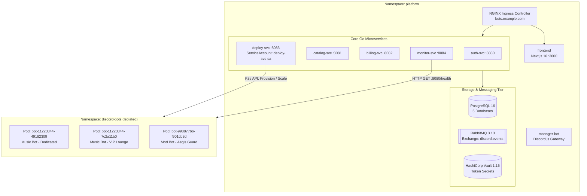
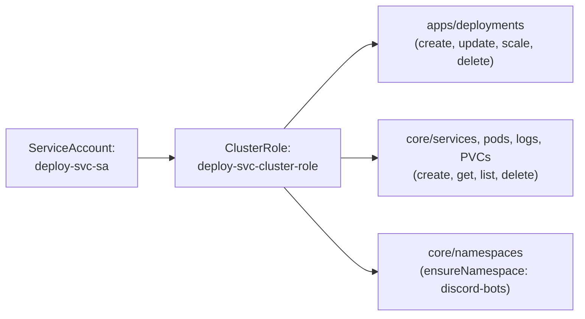
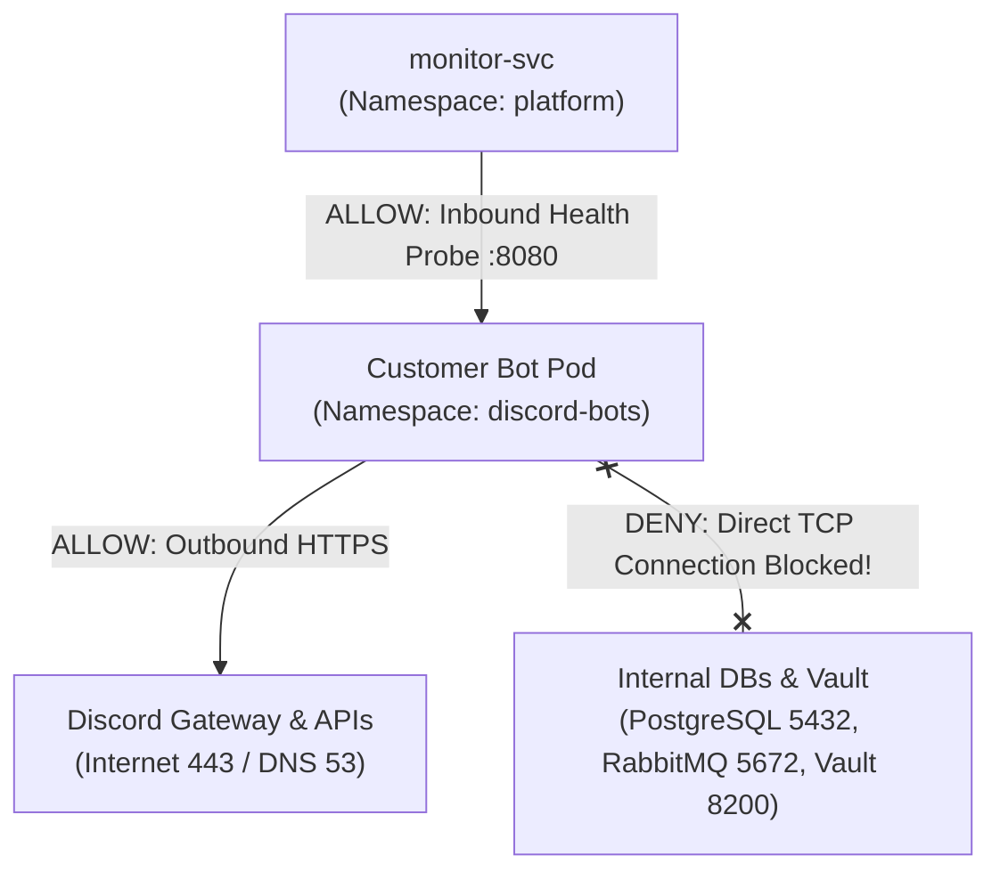

# Kubernetes Production Orchestration Guide

This document details the complete Kubernetes production deployment architecture, RBAC access controls, multi-tenant network isolation, and cluster management for the **Discord Bot Subscription Platform**.

---

## 1. Cluster Namespace Topology

The platform separates system workloads from customer bot containers using two dedicated namespaces:



| Namespace | Role | Security Standard |
| :--- | :--- | :--- |
| **`platform`** | Houses the 5 Go microservices, database, broker, secret vault, web UI, and manager bot. | Restricted system namespace |
| **`discord-bots`** | Sandbox namespace where customer single-tenant bot pods are dynamically spawned and scaled by `deploy-svc`. | Baseline Pod Security, isolated by NetworkPolicy |

---

## 2. Directory Structure (`k8s/`)

```text
k8s/
├── 00-namespaces.yaml               # Defines 'platform' and 'discord-bots' namespaces
├── 01-rbac.yaml                     # ServiceAccount, ClusterRole, & Binding for deploy-svc
├── 02-configmaps.yaml               # Environment settings and service discovery URLs
├── 03-secrets.yaml                  # Passwords, JWT secrets, and OAuth credentials template
├── 04-storage.yaml                  # PersistentVolumeClaims for Postgres, RabbitMQ, Vault
├── 05-infrastructure/
│   ├── postgres.yaml                # PostgreSQL StatefulSet, Service, & DB init ConfigMap
│   ├── rabbitmq.yaml                # RabbitMQ StatefulSet & Service (AMQP + UI)
│   └── vault.yaml                   # HashiCorp Vault Deployment & Service
├── 06-microservices/
│   ├── auth-svc.yaml                # auth-svc Deployment (2 replicas) & Service
│   ├── catalog-svc.yaml             # catalog-svc Deployment (2 replicas) & Service
│   ├── billing-svc.yaml             # billing-svc Deployment (2 replicas) & Service
│   ├── deploy-svc.yaml              # deploy-svc Deployment (2 replicas) & Service
│   └── monitor-svc.yaml             # monitor-svc Deployment (2 replicas) & Service
├── 07-applications/
│   ├── frontend.yaml                # Next.js 16 Web Dashboard Deployment & Service
│   └── manager-bot.yaml             # Discord Manager Bot Deployment (1 replica)
├── 08-ingress.yaml                  # NGINX Ingress rules with TLS Cert-Manager
├── 09-network-policy.yaml           # Tenant sandboxing: blocks bots from platform DBs
└── kustomization.yaml               # Single-command Kustomize deployment manifest
```

---

## 3. RBAC Privileges for `deploy-svc`

The deployment orchestrator runs as a pod inside Kubernetes and uses `client-go` with in-cluster service account authentication. It is bound to `deploy-svc-sa` with the following permissions:



---

## 4. Multi-Tenant Network Isolation (NetworkPolicy)

To guarantee that customer bot containers cannot compromise the internal infrastructure, `k8s/09-network-policy.yaml` enforces strict traffic boundaries:



- **Allowed Egress**: Internet HTTPS (port 443) and CoreDNS (port 53).
- **Allowed Ingress**: Health checks on port `8080` from `monitor-svc` in the `platform` namespace.
- **Denied Egress**: Any internal RFC1918 traffic targeting PostgreSQL (`5432`), RabbitMQ (`5672`), or Vault (`8200`).

---

## 5. Deployment Instructions

### Prerequisites
- Kubernetes cluster (v1.27+) or local environment (Minikube / Kind / K3s)
- `kubectl` configured with cluster administrator context
- Ingress controller (e.g. `ingress-nginx`) installed

### 1-Click Deployment via Kustomize
```bash
# 1. Inspect the generated manifests
kubectl kustomize k8s/

# 2. Apply all resources to the cluster
kubectl apply -k k8s/

# 3. Monitor rollout status of platform services
kubectl -n platform get pods -w
```

### Inspecting Running Bot Pods in Tenant Namespace
```bash
# List all active customer bot pods across all guilds
kubectl -n discord-bots get pods -o wide --show-labels

# Tail logs of a specific bot instance
kubectl -n discord-bots logs -f deployment/bot-11223344-49182309
```
