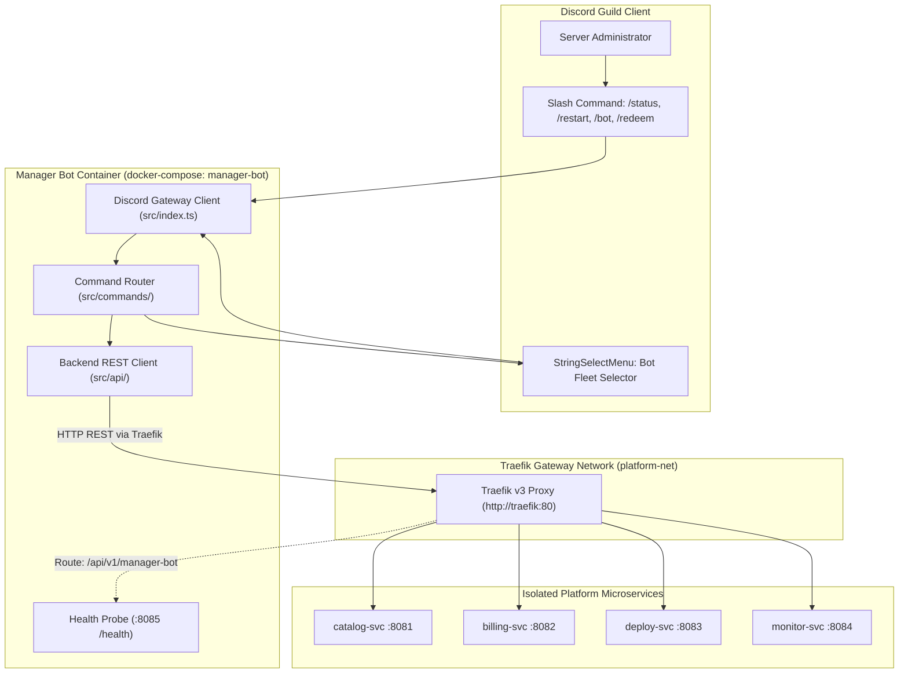
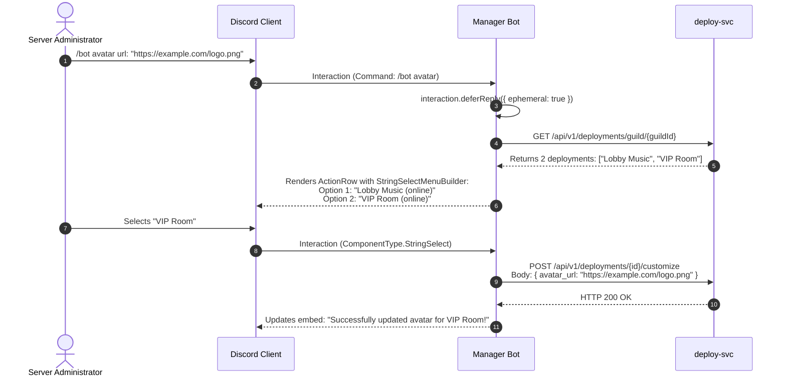

# Manager Bot Architecture & Command Manual

This document details the **Central Discord Manager Bot**, a dedicated bot written in TypeScript with **Discord.js v14** that acts as the in-chat management and control plane for the platform.

---

## 1. Manager Bot Overview

The Manager Bot lives in customer Discord guilds to provide instant access to fleet health, reboot controls, persona customization, and store subscriptions without requiring users to leave the Discord app.



---

## 2. Slash Commands Inventory

| Command | Arguments | Permissions Required | Description |
| :--- | :--- | :--- | :--- |
| **`/status`** | None | `ManageGuild` (0x20) | View fleet overview or select a specific bot instance to inspect ping, uptime, and container memory. |
| **`/restart`** | None | `Administrator` (0x8) | Reboot an unresponsive or sluggish bot container in the guild. Disambiguates with a dropdown if multiple bots exist. |
| **`/bot name`** | `name` (string) | `Administrator` (0x8) | Updates the public Discord username of a turnkey or dedicated bot instance. |
| **`/bot avatar`**| `url` (string) | `Administrator` (0x8) | Updates the public Discord avatar of a bot instance with image validation. |
| **`/store`** | None | Everyone | Displays catalog plans, pricing, feature highlights, and direct checkout buttons. |
| **`/redeem`** | `code` (string) | `ManageGuild` (0x20) | Redeems a 30-day or promotional gift voucher directly into an active subscription. |
| **`/help`** | None | Everyone | Interactive documentation embed explaining all available commands. |

---

## 3. Interactive Multi-Bot Disambiguation Workflow

When a command is executed in a guild with **two or more active bots**, the Manager Bot renders an interactive Discord **Select Menu (`StringSelectMenuBuilder`)** rather than executing on an arbitrary container.



### Component Builder Implementation Pattern
```typescript
const selectMenu = new StringSelectMenuBuilder()
  .setCustomId(`select-bot-${interaction.id}`)
  .setPlaceholder('Select which bot to customize...')
  .addOptions(
    deployments.map(dep => ({
      label: dep.instance_label || 'Default',
      description: `Type: ${dep.bot_type} | Status: ${dep.status}`,
      value: dep.id,
      emoji: dep.status === 'running' ? '🟢' : '🔴',
    }))
  );

const row = new ActionRowBuilder<StringSelectMenuBuilder>().addComponents(selectMenu);
await interaction.editReply({
  content: 'Multiple bots detected in this server. Please choose target:',
  components: [row],
});
```

---

## 4. Docker Deployment & Traefik Mesh Networking

The Manager Bot runs as a managed container (`discord_subscriptions_manager_bot`) alongside the Go microservices and Next.js frontend within the unified `platform-net` Docker network.

### 4.1 Traefik Network Connectivity
Rather than establishing disparate point-to-point connections to internal service ports, the Manager Bot routes all REST requests through the **Traefik Edge Gateway (`http://traefik:80`)**:
- **Environment Configuration**:
  - `TRAEFIK_URL=http://traefik` (or `GATEWAY_URL=http://traefik`)
  - `CATALOG_SVC_URL=http://traefik` -> routes `/api/v1/catalog/...` and `/api/v1/bots/...`
  - `BILLING_SVC_URL=http://traefik` -> routes `/api/v1/billing/...` and `/api/v1/vouchers/...`
  - `DEPLOY_SVC_URL=http://traefik` -> routes `/api/v1/deployments/...`
  - `MONITOR_SVC_URL=http://traefik` -> routes `/api/v1/monitor/...`
  - `DASHBOARD_URL=http://localhost`

### 4.2 Zero Host Port Ingress & Diagnostics Probe
- **Zero Host Exposure**: The bot container exposes no ports directly to the host machine.
- **Internal Probe**: An HTTP health check server listens on port `8085` (`/health`, `/livez`, `/readyz`).
- **Traefik Reverse Proxy Route**: Traefik exposes `/api/v1/manager-bot/health` through the reverse proxy, forwarding requests directly to `http://manager-bot:8085`.
- **Docker Healthcheck**: Configured with `wget -qO- http://127.0.0.1:8085/health` with a 10s interval and 10s start period.
- **Service Dependency Choreography**: The `manager-bot` container specifies `depends_on: traefik: condition: service_healthy`, ensuring the reverse proxy and all upstream microservices are active before the bot establishes its Discord Gateway websocket connection.
- **Timeout & Retries**: All HTTP requests enforce timeouts to comply with Discord's 3-second interaction deadline.
- **Graceful Degradation**: If an upstream service is temporarily cycling, the bot responds with an ephemeral Discord embed containing diagnostic status details instead of crashing.
