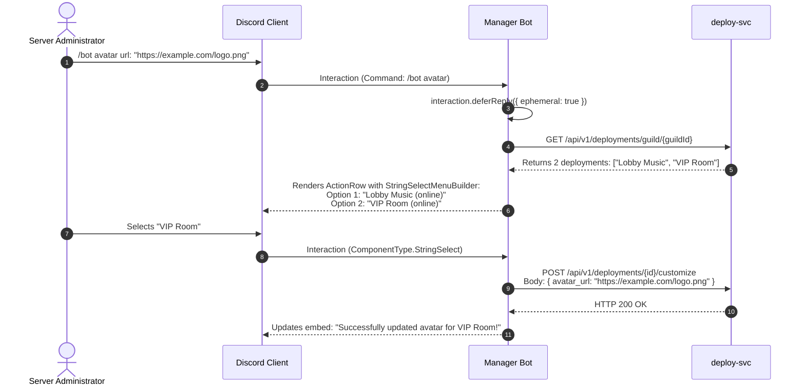

# Manager Bot Architecture & Command Manual

This document details the **Central Discord Manager Bot**, a dedicated bot written in TypeScript with **Discord.js v14** that acts as the in-chat management and control plane for the platform.

---

## 1. Manager Bot Overview

The Manager Bot lives in customer Discord guilds to provide instant access to fleet health, reboot controls, persona customization, and store subscriptions without requiring users to leave the Discord app.

```mermaid
flowchart TD
    subgraph DiscordUI [Discord Guild Client]
        AdminUser["Server Administrator"]
        SlashCmd["Slash Command: /status, /restart, /bot, /redeem"]
        Dropdown["StringSelectMenu: Bot Fleet Selector"]
    end

    subgraph ManagerBotCore [Manager Bot (TypeScript / Discord.js v14)]
        Gateway["Discord Gateway Client (src/index.ts)"]
        CmdRouter["Command Router (src/commands/)"]
        APIClient["Backend REST Client (src/api/client.ts)"]
    end

    subgraph BackendServices [Platform Microservices]
        CatalogSvc["catalog-svc :8081"]
        BillingSvc["billing-svc :8082"]
        DeploySvc["deploy-svc :8083"]
        MonitorSvc["monitor-svc :8084"]
    end

    AdminUser --> SlashCmd
    SlashCmd --> Gateway
    Gateway --> CmdRouter
    CmdRouter --> APIClient
    APIClient --> CatalogSvc & BillingSvc & DeploySvc & MonitorSvc
    CmdRouter --> Dropdown
    Dropdown --> Gateway
```

---

## 2. Slash Commands Inventory

| Command | Arguments | Permissions Required | Description |
| :--- | :--- | :--- | :--- |
| **`/status`** | None | `ManageGuild` (0x20) | View fleet overview or select a specific bot instance to inspect ping, uptime, and container memory. |
| **`/restart`** | None | `Administrator` (0x8) | Reboot an unresponsive or sluggish bot container in the guild. Disambiguates with a dropdown if multiple bots exist. |
| **`/bot name`** | `name` (string) | `Administrator` (0x8) | Updates the public Discord username of a turnkey or dedicated bot instance. |
| **`/bot avatar`**| `url` (string) | `Administrator` (0x8) | Updates the public Discord avatar of a bot instance with image validation. |
| **`/store`** | None | Everyone | Displays catalog plans, pricing, feature highlights, and direct checkout buttons. |
| **`/redeem`** | `code` (string) | `ManageGuild` (0x20) | Redeems a 30-day or promotional gift voucher directly into an active subscription. |
| **`/help`** | None | Everyone | Interactive documentation embed explaining all available commands. |

---

## 3. Interactive Multi-Bot Disambiguation Workflow

When a command is executed in a guild with **two or more active bots**, the Manager Bot renders an interactive Discord **Select Menu (`StringSelectMenuBuilder`)** rather than executing on an arbitrary container.



### Component Builder Implementation Pattern
```typescript
const selectMenu = new StringSelectMenuBuilder()
  .setCustomId(`select-bot-${interaction.id}`)
  .setPlaceholder('Select which bot to customize...')
  .addOptions(
    deployments.map(dep => ({
      label: dep.instance_label || 'Default',
      description: `Type: ${dep.bot_type} | Status: ${dep.status}`,
      value: dep.id,
      emoji: dep.status === 'running' ? '🟢' : '🔴',
    }))
  );

const row = new ActionRowBuilder<StringSelectMenuBuilder>().addComponents(selectMenu);
await interaction.editReply({
  content: 'Multiple bots detected in this server. Please choose target:',
  components: [row],
});
```

---

## 4. REST API Client Layer (`src/api/client.ts`)

The Manager Bot communicates with backend microservices over an internal Docker network or VPC using a typed HTTP client:

- **Base URLs Configured via Environment**:
  - `CATALOG_SVC_URL` (default: `http://catalog-svc:8081`)
  - `BILLING_SVC_URL` (default: `http://billing-svc:8082`)
  - `DEPLOY_SVC_URL` (default: `http://deploy-svc:8083`)
  - `MONITOR_SVC_URL` (default: `http://monitor-svc:8084`)
- **Timeout & Retries**: All HTTP requests enforce a 3-second timeout to comply with Discord's interaction response deadline.
- **Graceful Degradation**: If a microservice is temporarily unreachable, the bot sends an ephemeral apology with diagnostic error codes instead of crashing.
