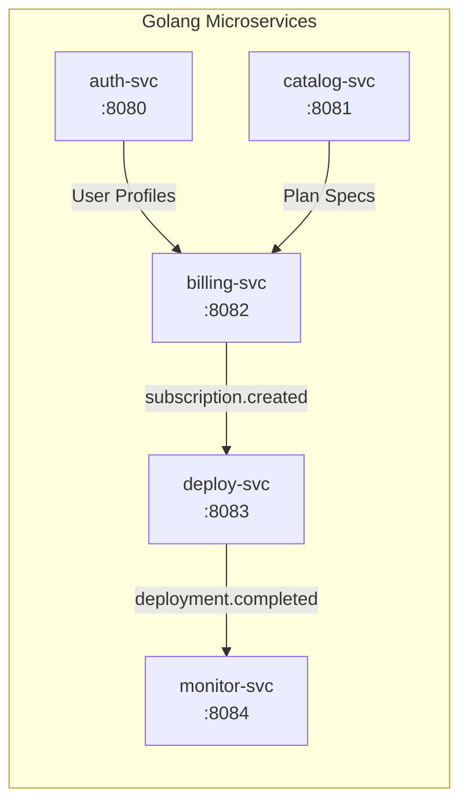

# Microservices Reference Manual

This document provides exhaustive documentation for all five Golang microservices powering the platform. Each section outlines the service's role, internal Clean Architecture layout, data contracts, and complete REST API specifications.

---

## 1. Overview & Service Inventory



| Service | Port | Database | Primary Responsibility |
| :--- | :--- | :--- | :--- |
| **[auth-svc](#2-auth-svc-port-8080)** | `8080` | `auth_db` | Discord OAuth2, user accounts, JWT issuance, session validation |
| **[catalog-svc](#3-catalog-svc-port-8081)** | `8081` | `catalog_db` | Bot templates, subscription tiers, pricing, feature flags |
| **[billing-svc](#4-billing-svc-port-8082)** | `8082` | `billing_db` | Subscriptions, PayPal webhooks, promo codes, gift vouchers |
| **[deploy-svc](#5-deploy-svc-port-8083)** | `8083` | `deploy_db` | K8s pod provisioning, token pool, 0-setup, bot persona customization |
| **[monitor-svc](#6-monitor-svc-port-8084)** | `8084` | `monitor_db` | Multi-target guild watchdog, ping latency, outage recovery events |

### Standardized Health & Probe Endpoints
Every Golang microservice embeds the `shared/health` package exposing three uniform probe endpoints:
- **`GET /health`** & **`GET /readyz`**: Deep health & readiness probe. Verifies database ping, RabbitMQ connectivity, and Vault status. Returns `200 OK` (status `"up"`) or `503 Service Unavailable` (status `"down"`).
- **`GET /livez`**: Shallow liveness probe. Verifies process responsiveness without stressing downstream dependencies. Always returns `200 OK`.

For complete payload schema and probe definitions, see [HEALTH_CHECKS.md](./HEALTH_CHECKS.md).

---

## 2. auth-svc (Port 8080)

### Purpose
Handles user identity via Discord OAuth2, issues cryptographically signed JWT tokens, and manages user profile sessions.

### REST API Endpoints

#### `GET /health`
Returns service availability status.
- **Response**: `200 OK`
```json
{ "status": "ok", "service": "auth-svc" }
```

#### `GET /api/v1/auth/discord/url`
Generates the Discord OAuth2 authorization URL with requested redirect URI.
- **Query Params**: `redirect_uri` (optional string)
- **Response**: `200 OK`
```json
{ "url": "https://discord.com/oauth2/authorize?client_id=...&scope=identify+guilds+email" }
```

#### `POST /api/v1/auth/discord/callback`
Exchanges the authorization code for a Discord user profile, updates `auth_db.users`, and returns a session JWT.
- **Body**: `{ "code": "...", "redirect_uri": "..." }`
- **Response**: `200 OK`
```json
{
  "data": {
    "token": "eyJhbGciOiJIUzI1NiIsInR5cCI6IkpXVCJ9...",
    "expires_at": "2026-10-03T12:00:00Z",
    "user": {
      "id": "112233445566778899",
      "username": "ServerOwner",
      "global_name": "Server Owner",
      "avatar": "a_1234567890abcdef",
      "email": "owner@example.com",
      "is_admin": false,
      "is_super_admin": false
    }
  }
}
```
*Note: Also sets an `HttpOnly`, `SameSite=Lax` cookie `auth_token` on the response for browser sessions.*

#### `POST /api/v1/auth/logout`
Logs out the user and clears the `auth_token` `HttpOnly` cookie.
- **Response**: `200 OK`
```json
{ "message": "Logged out successfully" }
```

#### `GET /api/v1/auth/me`
Retrieves current user identity from the Bearer token.
- **Headers**: `Authorization: Bearer <jwt>`
- **Response**: `200 OK`
```json
{
  "data": {
    "id": "112233445566778899",
    "username": "ServerOwner",
    "global_name": "Server Owner",
    "avatar": "a_1234567890abcdef",
    "email": "owner@example.com",
    "is_admin": false,
    "is_super_admin": false
  }
}
```

#### `GET /api/v1/auth/guilds`
Retrieves all Discord guilds where the authenticated user has server management permissions (`MANAGE_GUILD` or `ADMINISTRATOR`).
- **Headers**: `Authorization: Bearer <jwt>`
- **Response**: `200 OK`
```json
{
  "data": [
    {
      "id": "112233445566778899",
      "name": "My Discord Guild",
      "icon": "icon_hash",
      "owner": true,
      "permissions": "8",
      "canManage": true
    }
  ]
}
```

#### `GET /api/v1/auth/admins`
Lists all platform administrators (Super Admins configured via `SUPER_ADMIN_DISCORD_IDS` and appointed admins stored in database).
- **Headers**: `Authorization: Bearer <jwt>` (Admin or Super Admin only)
- **Response**: `200 OK`

#### `GET /api/v1/auth/users/search`
Searches registered users in `auth_db.users` by Discord Snowflake ID or username.
- **Headers**: `Authorization: Bearer <jwt>` (Super Admin only)
- **Query Params**: `q` (string)
- **Response**: `200 OK`

#### `POST /api/v1/auth/admins`
Promotes a registered Discord user to platform administrator.
- **Headers**: `Authorization: Bearer <jwt>` (Super Admin only)
- **Body**: `{ "discord_id": "112233445566778899" }`
- **Response**: `200 OK`

#### `DELETE /api/v1/auth/admins/{discordId}`
Revokes administrator privileges from an appointed administrator. Super Admins configured via environment cannot be revoked.
- **Headers**: `Authorization: Bearer <jwt>` (Super Admin only)
- **Response**: `200 OK`

---

## 3. catalog-svc (Port 8081)

### Purpose
Maintains the repository of supported bot templates (Music, Moderation, RPG) and their tiered subscription plans.

### REST API Endpoints

#### `GET /api/v1/catalog/templates`
Retrieves all active bot templates.
- **Response**: `200 OK`
```json
[
  {
    "id": "bot-music-01",
    "slug": "groovestream",
    "name": "GrooveStream Music",
    "description": "High-fidelity Discord music bot with Spotify, YouTube, and SoundCloud playback.",
    "category": "music",
    "docker_image": "ghcr.io/discord-subscriptions/music-bot",
    "default_image_tag": "v1.2.0",
    "supports_dedicated": true,
    "supports_shared": true
  }
]
```

#### `GET /api/v1/catalog/plans`
Retrieves all subscription pricing plans.
- **Response**: `200 OK`
```json
[
  {
    "id": "plan-music-pro",
    "bot_id": "bot-music-01",
    "name": "Pro Dedicated",
    "description": "Dedicated single-tenant instance with 320kbps, 24/7 mode, and custom bot persona.",
    "interval": "monthly",
    "price_cents": 799,
    "currency": "USD",
    "is_dedicated": true,
    "features": [
      "320kbps Ultra-HD",
      "24/7 Always Connected",
      "Dedicated K8s Pod",
      "Custom Bot Avatar & Name",
      "Bass Boost & Equalizer"
    ]
  }
]
```

---

## 4. billing-svc (Port 8082)

### Purpose
Manages subscription states, multi-bot billing in a single guild, coupon validation, gift voucher redemption, and payment provider integrations (PayPal).

### REST API Endpoints

#### `POST /api/v1/subscriptions`
Creates or activates a new bot subscription for a guild.
- **Request Body**:
```json
{
  "user_id": "112233445566778899",
  "guild_id": "998877665544332211",
  "plan_id": "plan-music-pro",
  "bot_type": "music",
  "instance_label": "VIP Lounge Music",
  "is_dedicated": true,
  "is_zero_setup": true,
  "promo_code": "SUMMER50"
}
```
- **Response**: `201 Created`
```json
{
  "id": "sub_1092830491823",
  "user_id": "112233445566778899",
  "guild_id": "998877665544332211",
  "plan_id": "plan-music-pro",
  "bot_type": "music",
  "instance_label": "VIP Lounge Music",
  "status": "active",
  "provider": "paypal",
  "is_dedicated": true,
  "is_zero_setup": true,
  "valid_until": "2026-10-26T00:00:00Z"
}
```

#### `GET /api/v1/subscriptions/guild/{guild_id}`
Returns all subscriptions belonging to a guild (supporting multi-bot fleet view).
- **Response**: `200 OK`
```json
[
  {
    "id": "sub_1092830491823",
    "guild_id": "998877665544332211",
    "bot_type": "music",
    "instance_label": "Main Lobby",
    "status": "active"
  },
  {
    "id": "sub_1092830491824",
    "guild_id": "998877665544332211",
    "bot_type": "music",
    "instance_label": "VIP Lounge",
    "status": "active"
  }
]
```

#### `POST /api/v1/promos/validate`
Validates a discount coupon code.
- **Request Body**: `{ "code": "SUMMER50", "plan_id": "plan-music-pro" }`
- **Response**: `200 OK`
```json
{
  "valid": true,
  "code": "SUMMER50",
  "discount_type": "percentage",
  "discount_value": 50,
  "discount_amount_cents": 399,
  "final_price_cents": 400
}
```

#### `POST /api/v1/vouchers/redeem`
Redeems a gift code for a free subscription period.
- **Request Body**:
```json
{
  "code": "GIFT-MUSIC-PRO-30D",
  "user_id": "112233445566778899",
  "guild_id": "998877665544332211",
  "instance_label": "Gifted Music Bot"
}
```
- **Response**: `200 OK` (Returns the generated active `Subscription` entity).

#### `POST /api/v1/billing/admin/grant`
Grants an administrator subscription without requiring payment.
- **Headers**: `Authorization: Bearer <jwt>` (Admin or Super Admin only)
- **Request Body**: `{ "user_id": "...", "guild_id": "...", "bot_type": "music", "plan_id": "plan-music-pro", "instance_label": "Mod Bot", "duration_days": 30, "is_dedicated": true, "is_zero_setup": true }`
- **Response**: `200 OK`

#### `POST /api/v1/billing/admin/promo`
Creates a new promotional discount code.
- **Headers**: `Authorization: Bearer <jwt>` (Admin or Super Admin only)
- **Request Body**: `{ "code": "SUMMER50", "discount_type": "percentage", "discount_value": 50, "max_uses": 100 }`
- **Response**: `201 Created`

#### `POST /api/v1/billing/admin/voucher`
Generates a new gift voucher redeemable by server owners.
- **Headers**: `Authorization: Bearer <jwt>` (Admin or Super Admin only)
- **Request Body**: `{ "plan_id": "plan-music-pro", "bot_type": "music", "duration_days": 30, "is_dedicated": true }`
- **Response**: `201 Created`

---

## 5. deploy-svc (Port 8083)

### Purpose
Acts as the infrastructure orchestration engine. Manages Kubernetes deployments, pre-warmed token pool reservations, HashiCorp Vault secret storage, and bot persona modifications.

### Key Deployment Pod Naming Convention
To prevent collisions when multiple bots are deployed to the same guild:
$$\text{Pod Name} = \text{bot}-\{\text{guildId}\}-\{\text{depShortId}\}$$
Example: `bot-99887766-a1b2c3d4`

### REST API Endpoints

#### `POST /api/v1/deployments`
Provisions a new bot deployment.
- **Request Body**:
```json
{
  "subscription_id": "sub_1092830491823",
  "user_id": "112233445566778899",
  "guild_id": "998877665544332211",
  "bot_type": "music",
  "instance_label": "Lobby Music",
  "is_zero_setup": true,
  "discord_token": ""
}
```
- **Response**: `201 Created`
```json
{
  "id": "dep_491823091823",
  "guild_id": "998877665544332211",
  "instance_label": "Lobby Music",
  "k8s_deployment_name": "bot-99887766-49182309",
  "status": "running",
  "is_zero_setup": true,
  "client_id": "131234567890123456"
}
```

#### `POST /api/v1/deployments/{id}/customize`
Updates a bot's Discord username and avatar in a running deployment.
- **Request Body**:
```json
{
  "bot_name": "GrooveStream VIP",
  "avatar_url": "https://cdn.example.com/avatars/vip.png"
}
```
- **Response**: `200 OK`
```json
{
  "status": "success",
  "message": "Bot persona updated successfully",
  "deployment_id": "dep_491823091823"
}
```

#### `GET /api/v1/admin/token-pool`
Admin overview of available vs reserved pre-warmed tokens.
- **Headers**: `Authorization: Bearer <jwt>` (Admin or Super Admin only)
- **Response**: `200 OK`
```json
{
  "stats": {
    "music": { "available": 4, "assigned": 6 },
    "moderation": { "available": 2, "assigned": 1 }
  }
}
```

#### `POST /api/v1/admin/token-pool`
Admin endpoint to ingest pre-created bot tokens into the turnkey pool. Tokens are securely written to HashiCorp Vault.
- **Headers**: `Authorization: Bearer <jwt>` (Admin or Super Admin only)
- **Request Body**:
```json
{
  "bot_type": "music",
  "tokens": [
    {
      "token": "MTMxMjM0NTY3ODkwMTIzNDk5.Gz9abc.super_secret_discord_bot_token",
      "client_id": "131234567890123499"
    }
  ]
}
```
- **Response**: `201 Created`

---

## 6. monitor-svc (Port 8084)

### Purpose
Watchdog service continuously polling HTTP `/healthz` endpoints of running bot containers, collecting response latencies, and triggering auto-restarts if a bot fails consecutive health probes.

### REST API Endpoints

#### `GET /api/v1/targets/guild/{guild_id}`
Returns all monitoring targets in a guild, showing individual statuses across the multi-bot fleet.
- **Response**: `200 OK`
```json
[
  {
    "id": "tgt_1",
    "bot_id": "dep_491823091823",
    "guild_id": "998877665544332211",
    "instance_label": "Lobby Music",
    "health_url": "http://bot-99887766-49182309:8080/healthz",
    "current_status": "online",
    "consecutive_failures": 0,
    "last_checked_at": "2026-09-26T02:30:00Z"
  }
]
```

#### `GET /api/v1/targets/{id}/logs`
Returns historical latency, ping, and memory metrics for a target.
- **Response**: `200 OK`
```json
[
  {
    "status": "online",
    "status_code": 200,
    "latency_ms": 14,
    "discord_ping_ms": 28,
    "memory_usage_mb": 142,
    "checked_at": "2026-09-26T02:30:00Z"
  }
]
```
