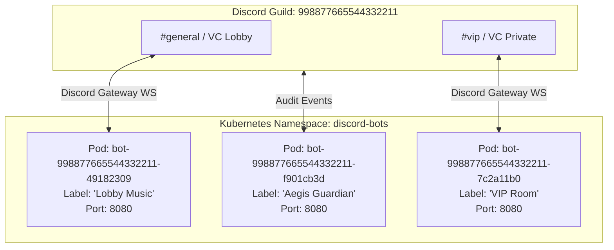
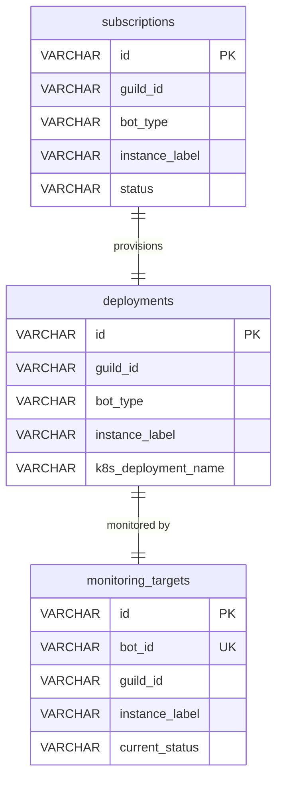
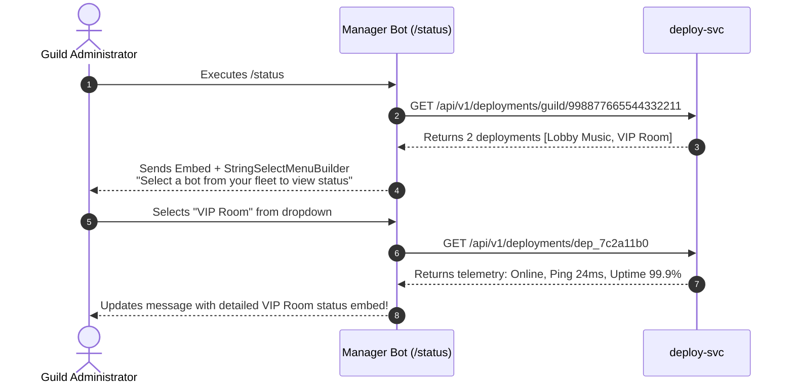

# Multi-Bot Fleet & Tenancy Architecture

This document explains how the platform facilitates running multiple subscriptions and multiple bot instances concurrently within a single Discord Guild without pod collisions, token conflicts, or user confusion.

---

## 1. The Multi-Subscription Challenge

In many large Discord communities, a single bot is insufficient:
- **Audio Channels**: A gaming guild often needs a Music bot in the *Public Lobby* and another in the *VIP Lounge*.
- **Role Isolation**: A server may want one Moderation bot strictly monitoring public text channels, and another dedicated to verifying new members.
- **Bot Diversity**: A server may subscribe to 2 Music bots, 1 Moderation bot, and 1 RPG bot simultaneously.

### The Technical Hazards
1. **Kubernetes Pod Name Collision**: If deployments are named `bot-{guildId}`, creating a second bot in the same guild throws `409 Conflict: AlreadyExists`.
2. **Database Key Conflicts**: If `monitoring_targets` has a `UNIQUE(guild_id)` constraint, only one bot per guild can be monitored.
3. **User Ambiguity**: If a user runs `/status` or `/restart`, which bot should respond or reboot?

---

## 2. Fleet Isolation & Pod Naming Formula

To guarantee complete isolation at the container orchestration layer:

$$\mathbf{Pod\ Name} = \mathbf{bot}\text{–}\{\mathbf{guildId}\}\text{–}\{\mathbf{depShortId}\}$$

- `guildId`: The Discord Guild Snowflake ID (e.g. `998877665544332211`)
- `depShortId`: The first 8 hexadecimal characters of the unique deployment UUID (e.g. `49182309`)



Each bot deployment runs in its own single-tenant pod, has dedicated memory/CPU limits, and communicates independently over its own Discord Gateway WebSocket connection.

---

## 3. Instance Labeling Architecture

Every entity in the platform tracking a bot instance includes an `instance_label`:



### Label Invariants:
- **Defaults**: If omitted during checkout, `instance_label` defaults to `"Default"`.
- **Customizable**: Users can name instances during checkout (e.g., `"Chill Vibes"`, `"Hardcore Gaming"`, `"Staff Moderation"`).
- **Relational Integrity**: The label propagates through `subscriptions` $\to$ `deployments` $\to$ `monitoring_targets`.

---

## 4. Discord Manager Bot Disambiguation UX

When multiple bots reside in a server, slash commands cannot assume which bot the user intends to manage. The Manager Bot solves this via interactive Discord **Select Menus (`StringSelectMenuBuilder`)**.



### Commands Supporting Fleet Disambiguation:
- `/status`: Lists all fleet bots or renders select dropdown for single-bot telemetry inspection.
- `/restart`: Displays dropdown for server admins to reboot an exact bot instance without disturbing others.
- `/bot name <new_name>`: Displays dropdown allowing the admin to choose which bot instance's Discord username to update.
- `/bot avatar <url>`: Displays dropdown allowing the admin to choose which bot instance's Discord avatar to update.

---

## 5. Web Dashboard Fleet Switcher

On the Next.js Web Dashboard (`/dashboard`), servers with multiple bots display a horizontal Fleet Switcher bar:

```text
+--------------------------------------------------------------------------------+
|  [ 🌐 ALL BOTS (3) ]   [ 🎵 Lobby Music ]   [ 🎵 VIP Room ]   [ 🛡️ Aegis Guard ] |
+--------------------------------------------------------------------------------+
```

- Clicking **ALL BOTS** presents a cluster-wide operational overview.
- Clicking a specific bot tab focuses the view on that instance:
  - Live container CPU / Memory graphs
  - Real-time Discord Gateway latency
  - Customization controls (change persona name & avatar)
  - Deployment logs and restart buttons
