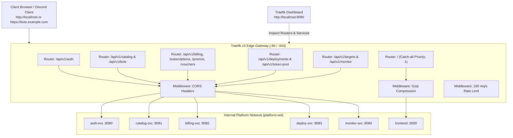

# Traefik Reverse Proxy & Unified API Gateway

This document details the **Traefik v3 Reverse Proxy & Edge Gateway** architecture used to provide a unified HTTP/HTTPS entrypoint (`:80` / `:443`), SSL termination, CORS handling, rate-limiting, and path-based routing for the platform.

---

## 1. Gateway Architecture & Topology

Before Traefik, each microservice exposed its own individual host port (`8080` to `8084`) and the Next.js frontend ran on `:3000`, requiring complex cross-origin resource sharing (CORS) configurations.

With Traefik acting as the unified edge gateway:
- **Clients communicate through a single port** (`:80` for local HTTP, `:443` for production HTTPS).
- **Internal ports remain shielded** behind the Docker network (`platform-net`) or Kubernetes ClusterIP.
- **Traefik Web Dashboard** provides real-time traffic visualization and health metrics at `:8090`.



---

## 2. Path Routing Matrix

Traefik evaluates incoming request paths using **PathPrefix** rules:

| Route Path Prefix | Target Microservice | Port | Features & Middlewares |
| :--- | :--- | :--- | :--- |
| **`/api/v1/auth`** | `auth-svc` | `:8080` | Discord OAuth2 callbacks, user account info, session JWTs |
| **`/api/v1/catalog`**<br>**`/api/v1/bots`** | `catalog-svc` | `:8081` | Bot templates, tiers, feature flags, pricing |
| **`/api/v1/billing`**<br>**`/api/v1/subscriptions`**<br>**`/api/v1/promos`**<br>**`/api/v1/vouchers`**<br>**`/api/v1/webhooks`** | `billing-svc` | `:8082` | Checkout, PayPal webhooks, promo codes, gift voucher redemption |
| **`/api/v1/deployments`**<br>**`/api/v1/deploy`**<br>**`/api/v1/token-pool`** | `deploy-svc` | `:8083` | Pod provisioning, turnkey token allocation, persona customization |
| **`/api/v1/targets`**<br>**`/api/v1/monitor`** | `monitor-svc` | `:8084` | Health logs, real-time container metrics, watchdog status |
| **`/`** *(Catch-all, priority 1)* | `frontend` | `:3000` | Next.js 16 Web Dashboard, Storefront, Admin Panel |

---

## 3. Configuration Layout

### 3.1 Static Configuration ([`traefik/traefik.yml`](file:///C:/Users/kasep/Desktop/discord-subscriptions/traefik/traefik.yml))
Configures EntryPoints, providers, logging, and the API dashboard:
- `entryPoints.web.address`: `:80`
- `entryPoints.websecure.address`: `:443`
- `entryPoints.traefik.address`: `:8080` (mapped to host `8090:8080`)
- `providers.file.directory`: `/etc/traefik/dynamic`
- `providers.docker.endpoint`: `unix:///var/run/docker.sock`

### 3.2 Dynamic Configuration ([`traefik/dynamic/dynamic.yml`](file:///C:/Users/kasep/Desktop/discord-subscriptions/traefik/dynamic/dynamic.yml))
Defines the routers, middlewares, and backend server load balancers.

### 3.3 Middlewares Applied:
1. **`cors-headers`**: Configures permissive CORS headers for local and production web clients.
2. **`compress`**: Enables Gzip and Brotli response compression for faster client asset loading.
3. **`api-ratelimit`**: Defends backend services against brute force and DDoS attacks by enforcing a sliding window limit of 100 req/s with a burst allowance of 50.

---

## 4. Local Testing with Docker Compose

To start the platform with Traefik:

```bash
# 1. Start all containers including Traefik
docker compose up -d

# 2. Access the Next.js Frontend through Traefik (Port 80)
http://localhost/

# 3. Access the Traefik Visual Dashboard
http://localhost:8090/dashboard/

# 4. Test API routing through Traefik:
curl -i http://localhost/api/v1/catalog/templates
curl -i http://localhost/api/v1/subscriptions/guild/12345
```

---

## 5. Kubernetes Integration (`k8s/`)

For Kubernetes environments, Traefik can be used via:
1. Standard Ingress ([`k8s/08-traefik-ingress.yaml`](file:///C:/Users/kasep/Desktop/discord-subscriptions/k8s/08-traefik-ingress.yaml)) with `ingressClassName: traefik`.
2. Traefik CRDs ([`IngressRoute`](file:///C:/Users/kasep/Desktop/discord-subscriptions/k8s/08-traefik-ingress.yaml)) allowing advanced middleware chaining and circuit breaking.
