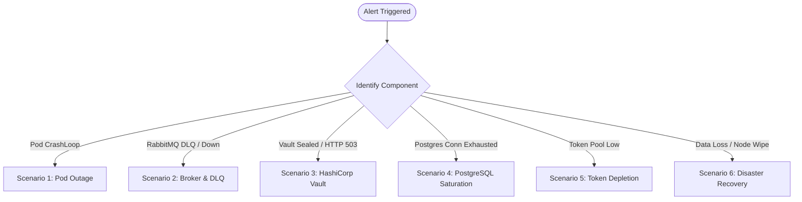

# Production Operations Runbook & Incident Response Manual

> **Scope**: Discord Bot Subscription & Turnkey Fleet Management Platform  
> **Audience**: Platform Engineers, SREs, On-Call Operators, DevOps Engineers  
> **Last Updated**: 2026-09-26  

---

## 1. Incident Management Overview

### 1.1 Severity Classification Matrix

| Severity | Definition | Target MTTA | Target MTTR | Escalation Path |
| :--- | :--- | :--- | :--- | :--- |
| **SEV-1 (Critical)** | Core control-plane down (`billing-svc`, `deploy-svc`), customer bot fleet unreachable, Vault sealed, or critical data loss. | < 5 mins | < 30 mins | Page On-Call Lead + SRE Lead |
| **SEV-2 (High)** | Degradation of a single microservice (`catalog-svc`, `monitor-svc`), partial token pool depletion, or elevated 5xx error rate (>5%). | < 15 mins | < 2 hours | Page Secondary On-Call |
| **SEV-3 (Medium)** | Individual bot pod restart failures, non-critical latency spikes, promotion voucher validation edge cases. | < 1 hour | < 8 hours | Ticket to Platform Engineering |
| **SEV-4 (Low)** | Minor UI cosmetic discrepancies, non-urgent metric scraping anomalies. | < 4 hours | < 24 hours | Standard Sprint Backlog |

### 1.2 Telemetry & Alerting Quick Reference
- **Prometheus UI**: `http://localhost:9090` (or `http://prometheus.platform.svc:9090`)
- **Grafana Dashboards**: `http://localhost:3001` (Dashboard: `discord-bot-platform-overview`)
- **Traefik Dashboard**: `http://localhost:8080/dashboard/`
- **RabbitMQ Management**: `http://localhost:15672` (User: `guest` / `guest`)
- **Vault Status**: `http://localhost:8200/v1/sys/health`

---

## 2. Standard Incident Scenarios



---

### Scenario 1: Pod Crashloop & Service Outage

#### Symptoms
- Prometheus alert: `PodCrashLooping` or `ServiceUnavailable` (`up == 0`).
- Traefik edge proxy returns `HTTP 502 Bad Gateway` or `HTTP 503 Service Unavailable`.
- Kubernetes pod status displays `CrashLoopBackOff`, `Error`, or `OOMKilled`.

#### Diagnostic Steps
1. **Identify the failing pods**:
   ```bash
   kubectl get pods -n platform
   kubectl get pods -n discord-bots
   ```
2. **Inspect recent termination reason**:
   ```bash
   kubectl describe pod <pod-name> -n <namespace>
   # Look for: Last State -> Exit Code, Terminated Reason (e.g., OOMKilled: exit code 137)
   ```
3. **Stream pod logs**:
   ```bash
   kubectl logs <pod-name> -n <namespace> --previous --tail=100
   ```

#### Resolution Runbook
- **Case A: `OOMKilled` (Exit Code 137)**
  1. Patch the deployment resource limits in `k8s/06-microservices/<service>.yaml`:
     ```bash
     kubectl set resources deployment/<service-name> -n platform --limits=memory=512Mi --requests=memory=256Mi
     ```
  2. Monitor memory growth using Grafana memory graphs to detect potential goroutine or buffer leaks.
- **Case B: Database / Vault Connection Failure on Startup**
  1. Verify the service can resolve PostgreSQL and Vault DNS:
     ```bash
     kubectl exec -it deployment/<service-name> -n platform -- nc -zv postgres.platform.svc 5432
     kubectl exec -it deployment/<service-name> -n platform -- nc -zv vault.platform.svc 8200
     ```
  2. If credentials failed, check the secret mount:
     ```bash
     kubectl get secret platform-secrets -n platform -o yaml
     ```
- **Case C: Faulty Code Rollout**
  1. Roll back the deployment immediately:
     ```bash
     kubectl rollout undo deployment/<service-name> -n platform
     kubectl rollout status deployment/<service-name> -n platform
     ```

---

### Scenario 2: RabbitMQ Outage & Dead-Letter Queue (DLQ) Triage

#### Symptoms
- Microservices log: `Failed to publish message: connection refused` or `channel closed`.
- Subscription purchases succeed in `billing-svc` but `deploy-svc` does not provision pods.
- Alert: `RabbitMQQueueDepthGrowing` or `DeadLetterQueueNotEmpty`.

#### Diagnostic Steps
1. **Check RabbitMQ cluster health**:
   ```bash
   kubectl exec -it rabbitmq-0 -n platform -- rabbitmq-diagnostics check_running
   kubectl exec -it rabbitmq-0 -n platform -- rabbitmq-diagnostics check_alarms
   ```
2. **Inspect queue depths**:
   ```bash
   kubectl exec -it rabbitmq-0 -n platform -- rabbitmqctl list_queues name messages consumers
   ```
3. **Inspect the dead-letter exchange / queue**:
   ```bash
   kubectl exec -it rabbitmq-0 -n platform -- rabbitmqctl list_queues | grep dlq
   ```

#### Resolution Runbook
1. **Clear Resource Alarms (Disk / Memory)**:
   If alarms are blocking publishers:
   ```bash
   # Check alarm details
   kubectl exec -it rabbitmq-0 -n platform -- rabbitmqctl status
   ```
   Expand the RabbitMQ PersistentVolumeClaim if disk watermark (>80%) tripped.
2. **Replay Dead-Letter Queue (DLQ) Messages**:
   Once the downstream consumer bug is resolved:
   ```bash
   # Enable RabbitMQ Shovel plugin if not enabled
   kubectl exec -it rabbitmq-0 -n platform -- rabbitmq-plugins enable rabbitmq_shovel
   
   # Move messages from DLQ back to primary topic exchange
   kubectl exec -it rabbitmq-0 -n platform -- rabbitmqctl eval '
     rabbit_shovel_parameters:set(<<"replay-dlq">>, [
       {sources, [{queue, <<"discord.events.dlq">>}]},
       {destinations, [{exchange, <<"discord.events">>}, {routing_key, <<"#">>}]},
       {acknowledge_after, on_confirm}
     ]).'
   ```
3. **Verify Message Idempotency**:
   All consumers (`deploy-svc`, `monitor-svc`) are guaranteed idempotent by tracking `subscription_id` and `deployment_id`. Replaying does NOT cause duplicate pod deployments.

---

### Scenario 3: HashiCorp Vault Unseal & Secret Rotation

#### Symptoms
- `deploy-svc` logs: `Vault returned HTTP 503: Vault is sealed` or `permission denied`.
- Unable to retrieve turnkey bot tokens or decrypt customer tokens.
- Health endpoint `GET http://vault:8200/v1/sys/health` returns `503`.

#### Diagnostic Steps
1. **Check seal status**:
   ```bash
   kubectl exec -it vault-0 -n platform -- vault status
   ```
   Look for `Sealed: true`.

#### Resolution Runbook
1. **Unseal the Vault cluster**:
   Retrieve the Shamir unseal keys from the secure offline vault key storage:
   ```bash
   kubectl exec -it vault-0 -n platform -- vault operator unseal <UNSEAL_KEY_1>
   kubectl exec -it vault-0 -n platform -- vault operator unseal <UNSEAL_KEY_2>
   kubectl exec -it vault-0 -n platform -- vault operator unseal <UNSEAL_KEY_3>
   ```
2. **Verify Vault unsealed**:
   ```bash
   kubectl exec -it vault-0 -n platform -- vault status
   # Should report: Sealed: false
   ```
3. **Rotating Bot Master Secret**:
   If a compromise or annual key rotation is required:
   ```bash
   # 1. Update the master token encryption key in Kubernetes secrets
   kubectl create secret generic platform-secrets \
     --from-literal=VAULT_DEV_ROOT_TOKEN_ID=<NEW_TOKEN> \
     --dry-run=client -o yaml | kubectl apply -n platform -f -
   
   # 2. Restart deploy-svc to pick up new client credentials
   kubectl rollout restart deployment/deploy-svc -n platform
   ```

---

### Scenario 4: PostgreSQL Connection Pool Saturation & Lock Contention

#### Symptoms
- Microservice logs: `pq: remaining connection slots are reserved for non-replication superuser connections` or `context deadline exceeded (SQL timeout)`.
- HTTP latency spikes across all API routes.

#### Diagnostic Steps
1. **Inspect active connections per database**:
   ```bash
   kubectl exec -it postgres-0 -n platform -- psql -U postgres -c "
     SELECT datname, count(*) as connections 
     FROM pg_stat_activity 
     GROUP BY datname 
     ORDER BY connections DESC;"
   ```
2. **Find long-running transactions and locks**:
   ```bash
   kubectl exec -it postgres-0 -n platform -- psql -U postgres -c "
     SELECT pid, now() - pg_stat_activity.query_start AS duration, query, state 
     FROM pg_stat_activity 
     WHERE state != 'idle' AND (now() - pg_stat_activity.query_start) > interval '10 seconds'
     ORDER BY duration DESC;"
   ```

#### Resolution Runbook
1. **Terminate blocking queries**:
   ```bash
   kubectl exec -it postgres-0 -n platform -- psql -U postgres -c "
     SELECT pg_terminate_backend(<PID>);"
   ```
2. **Tune Microservice Connection Pool**:
   Microservices configure Go `sql.DB` connection bounds via environment variables:
   - `DB_MAX_OPEN_CONNS` (default: 25)
   - `DB_MAX_IDLE_CONNS` (default: 10)
   - `DB_CONN_MAX_LIFETIME` (default: 5m)
   If a cluster has many replicas, reduce `DB_MAX_OPEN_CONNS` per pod to `10` or increase Postgres `max_connections` in `postgresql.conf`:
   ```bash
   kubectl exec -it postgres-0 -n platform -- psql -U postgres -c "ALTER SYSTEM SET max_connections = 300;"
   kubectl rollout restart statefulset/postgres -n platform
   ```

---

### Scenario 5: Zero-Setup Token Pool Depletion & Batch Provisioning

#### Symptoms
- User checkout error: `Turnkey bot deployment failed: no available pre-warmed tokens in pool`.
- Alert: `TokenPoolLow` (< 5 available tokens in `deploy_db.token_pool`).

#### Diagnostic Steps
1. **Query token pool inventory**:
   ```bash
   kubectl exec -it postgres-0 -n platform -- psql -U postgres -d deploy_db -c "
     SELECT bot_type, status, count(*) 
     FROM token_pool 
     GROUP BY bot_type, status;"
   ```

#### Resolution Runbook
1. **Create Bot Applications on Discord Developer Portal**:
   - Go to [Discord Developer Portal](https://discord.com/developers/applications).
   - Create the necessary number of bot applications for the depleted bot type (e.g. 10 music bots).
   - Enable `Server Members Intent` and `Message Content Intent`.
   - Copy Application ID and Bot Token.
2. **Batch Seed Tokens via Admin CLI / API**:
   Execute the batch import API endpoint (protected by Super Admin JWT):
   ```bash
   curl -X POST https://bots.example.com/api/v1/token-pool/batch \
     -H "Authorization: Bearer <SUPER_ADMIN_JWT>" \
     -H "Content-Type: application/json" \
     -d '{
       "tokens": [
         {
           "bot_type": "music",
           "application_id": "123456789012345678",
           "token": "MTEyMjMzNDQ1NQ.Example.SecretDiscordTokenGoesHere"
         }
       ]
     }'
   ```
3. **Verify Pool Recovery**:
   ```bash
   curl -s -H "Authorization: Bearer <SUPER_ADMIN_JWT>" \
     https://bots.example.com/api/v1/token-pool/stats | jq .
   ```

---

### Scenario 6: Disaster Recovery & Database Snapshot Restore

#### Recovery Point Objective (RPO): < 15 minutes  
#### Recovery Time Objective (RTO): < 30 minutes  

#### Disaster Recovery Procedures
1. **Stop ingress traffic to prevent data mutation**:
   ```bash
   kubectl scale deployment traefik -n platform --replicas=0
   ```
2. **Verify backup snapshot integrity**:
   Backups are stored on S3/MinIO under `s3://platform-backups/postgres/`.
   ```bash
   aws s3 ls s3://platform-backups/postgres/
   ```
3. **Restore target database**:
   ```bash
   # Download snapshot
   aws s3 cp s3://platform-backups/postgres/platform_snapshot_latest.sql.gz /tmp/snapshot.sql.gz
   gunzip /tmp/snapshot.sql.gz
   
   # Copy to postgres pod and restore
   kubectl cp /tmp/snapshot.sql platform/postgres-0:/tmp/snapshot.sql
   kubectl exec -it postgres-0 -n platform -- psql -U postgres -f /tmp/snapshot.sql
   ```
4. **Run schema validation & migrations**:
   Ensure `scripts/init-databases.sql` constraints are satisfied:
   ```bash
   kubectl exec -it postgres-0 -n platform -- psql -U postgres -f /scripts/init-databases.sql
   ```
5. **Resume ingress traffic**:
   ```bash
   kubectl scale deployment traefik -n platform --replicas=2
   ```
6. **Perform Smoke Test**:
   - Verify health endpoints across all 5 microservices (`/healthz`).
   - Log in via Discord OAuth2 on frontend.
   - Run a test status query via manager bot (`/status`).

---

## 3. Maintenance & Rotation Checklist

| Cadence | Task | Owner | Command / Reference |
| :--- | :--- | :--- | :--- |
| **Weekly** | Audit token pool inventory (> 10 available per bot tier) | Platform Team | `/api/v1/token-pool/stats` |
| **Bi-Weekly** | Review Grafana RED latency distributions & HPA trigger thresholds | SRE | Dashboard: `discord-bot-platform-overview` |
| **Monthly** | Verify PostgreSQL pg_dump snapshot restoration in staging | SRE | Scenario 6 DR drill |
| **Quarterly** | HashiCorp Vault token rotation & Shamir key drill | Security Team | Scenario 3 Runbook |
| **Quarterly** | Discord Developer Application secret audit | Platform Team | Discord Dev Portal |
