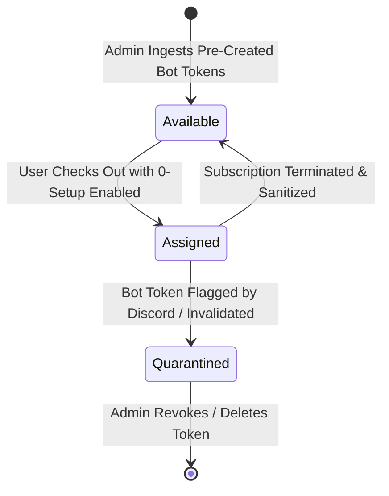
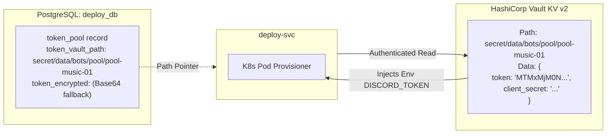
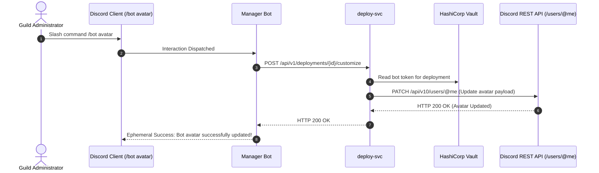

# Zero-Setup Turnkey Bot Engine & Token Pool

This document details the **Zero-Setup Turnkey Delivery** system—an enterprise mechanism allowing non-technical customers to purchase and run dedicated Discord bots with **zero initial configuration**, without ever visiting the Discord Developer Portal or creating bot applications.

---

## 1. The Zero-Setup Philosophy

Traditional Discord bot hosting services require customers to:
1. Navigate to the Discord Developer Portal.
2. Create an Application and Bot User.
3. Enable Privileged Gateway Intents (Message Content, Server Members).
4. Copy the Bot Token and Client Secret.
5. Generate an OAuth2 invite URL with appropriate permissions integer.

For casual community moderators and server owners, this friction causes high checkout abandonment.

### The Turnkey Solution
With **Zero-Setup Delivery**:
- The platform maintains a **pre-warmed pool of ready-to-run Discord bot tokens**.
- During checkout, the customer simply toggles `[x] Zero-Setup Turnkey Delivery`.
- `deploy-svc` instantly reserves a pre-warmed token, configures the Kubernetes container, and issues a 1-click bot invite link.
- Customers can immediately customize the bot's public persona (username and avatar) via simple chat commands.

---

## 2. Pre-Warmed Token Pool Lifecycle



### Token State Definitions:
| State | Description |
| :--- | :--- |
| **`available`** | Verified, pre-registered bot token ready to be instantly provisioned to a new subscriber. |
| **`assigned`** | Actively bound to a running deployment and specific Discord Guild. |
| **`quarantined`** | Token encountered a Discord API 401 Unauthorized or rate limit anomaly; removed from circulation pending admin audit. |

---

## 3. Database Schema: `deploy_db.token_pool`

```sql
CREATE TABLE IF NOT EXISTS token_pool (
    id VARCHAR(64) PRIMARY KEY,
    bot_type VARCHAR(64) NOT NULL,
    client_id VARCHAR(64) NOT NULL,
    token_vault_path VARCHAR(255) NOT NULL,
    token_encrypted TEXT,
    status VARCHAR(32) NOT NULL DEFAULT 'available',
    assigned_guild_id VARCHAR(64),
    assigned_subscription_id VARCHAR(64),
    assigned_at TIMESTAMP WITH TIME ZONE,
    created_at TIMESTAMP WITH TIME ZONE DEFAULT CURRENT_TIMESTAMP,
    updated_at TIMESTAMP WITH TIME ZONE DEFAULT CURRENT_TIMESTAMP
);

CREATE INDEX IF NOT EXISTS idx_token_pool_type_status ON token_pool(bot_type, status);
CREATE INDEX IF NOT EXISTS idx_token_pool_guild_id ON token_pool(assigned_guild_id);
```

---

## 4. HashiCorp Vault Secret Storage

To prevent credential leakage in the event of database exfiltration, raw bot tokens are stored exclusively in **HashiCorp Vault KV v2**.



---

## 5. Token Ingestion API (Admin)

Platform administrators pre-populate the token pool using the admin REST API:

### `POST /api/v1/token-pool/tokens`
- **Request Body**:
```json
{
  "bot_type": "music",
  "client_id": "131234567890123499",
  "discord_token": "MTMxMjM0NTY3ODkwMTIzNDk5.Gz9abc.super_secret_discord_bot_token"
}
```
- **Execution Flow**:
  1. `deploy-svc` generates a pool ID (`pool-{bot_type}-{nanoid}`).
  2. Writes the token to Vault under `secret/data/bots/pool/{id}`.
  3. Inserts metadata record into `deploy_db.token_pool` with `status = 'available'`.
  4. Returns `201 Created`.

---

## 6. Dynamic Bot Persona Customization

Because turnkey bots are pre-created, users may want to rebrand their bot to match their server theme (e.g., renaming the Music bot to *"Club Cyber Radio"* and changing its profile picture).



### Endpoints Supporting Customization:
- **API**: `POST /api/v1/deployments/{id}/customize`
- **Slash Commands**:
  - `/bot name <new_name>`
  - `/bot avatar <image_url>`
- **Web Dashboard**: Direct live preview editor on `/dashboard`.
